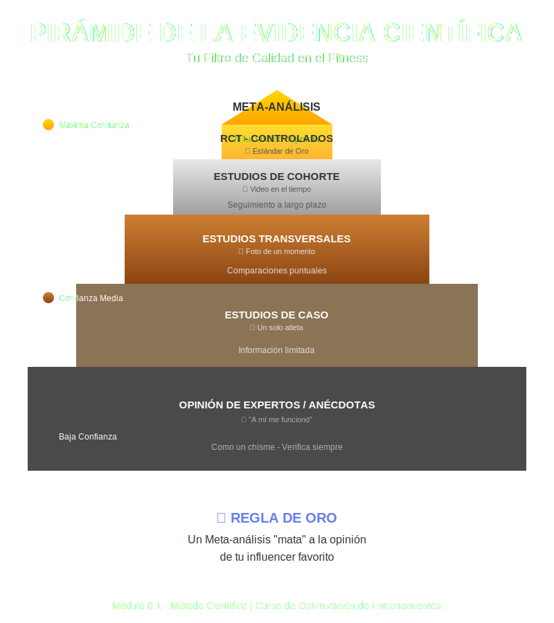

# Tema 0.1: Método Científico y Lectura Crítica de Literatura

## Introducción: El Mapa y la Brújula

Imagina que entrenar es explorar un territorio desconocido.

* La **experiencia personal** es caminar mirando tus propios pies; sabes dónde pisas, pero no a dónde vas.
* Los **"gurús"** te venden mapas detallados que a menudo son falsos o anticuados.
* La **Ciencia** es tu brújula. No te dice exactamente dónde está cada árbol, pero te asegura que vas al Norte y no en círculos.

En el fitness, diferenciar la señal del ruido es vital. Este tema te enseña a calibrar tu brújula.

## 1. La Jerarquía de la Evidencia (Tu Filtro de Calidad)

Imagina una pirámide. Lo que está abajo es abundante pero de baja calidad; lo de arriba es escaso pero puro oro.

* **Nivel 1 (Base): Opinión de Expertos / Anécdotas**. "A mí me funcionó".
  * *Analogía*: Como un chisme. Puede ser cierto, pero mejor verifícalo.
* **Nivel 2: Estudios de Caso**. Análisis de un solo atleta.
* **Nivel 3: Estudios Transversales**. Una "foto" de un momento (ej. comparar culturistas vs. powerlifters).
* **Nivel 4: Estudios de Cohorte**. Seguir un grupo en el tiempo (video vs foto).
* **Nivel 5: Ensayos Controlados Aleatorizados (RCT)**. **El estándar de oro**.
  * *Cómo funciona*: Tomas 20 gemelos, a uno le das creatina y al otro placebo. Si uno crece más, es la creatina. (Causa y Efecto).
* **Nivel 6 (Cima): Meta-análisis**. Juntar todos los RCTs del mundo sobre un tema y sacar una conclusión global. La verdad suprema (por ahora).

**Regla de Oro**: Un Meta-análisis "mata" a la opinión de tu influencer favorito.

## 2. Anatomía de un Paper (Lectura Rápida en 5 min)

No te ahogues en tecnicismos. Busca esto:

1. **Abstract**: El "trailer" de la película.
2. **MÉTODOS (¡Aquí está la trampa!)**:
    * *¿Quiénes son?*: Si el estudio usó ancianos de 80 años, ¿aplica a tu atleta de 20? **(Contexto)**.
    * *¿Qué hicieron?*: ¿El volumen fue igual? ¿La dieta fue controlada?
3. **Resultados**: ¿Hubo diferencias reales?
    * *Concepto Clave*: **P-value < 0.05**. Significa que hay menos de un 5% de probabilidad de que el resultado fuera suerte. Es el sello de "estadísticamente significativo".
4. **Discusión**: La opinión de los autores. Tómala con pinzas.

## 3. Sesgos y Trampas Comunes

* **Cherry-picking (Cosecha de cerezas)**: Seleccionar solo el único estudio que te da la razón e ignorar los 99 que dicen lo contrario.
* **Conflicto de Interés**: Estudio sobre "Proteína X" financiado por "Empresa X". Sospechoso.
* **N pequeño**: Estudiar a 4 personas es como tirar una moneda 4 veces; no puedes concluir que siempre sale cara.

## 4. Aplicación Práctica: "Evidence-Informed"

Ser basado en evidencia NO es ser un robot científico. Es una mesa de tres patas:

1. **Mejor evidencia disponible**: Lo que dicen los papers.
2. **Experiencia del entrenador**: Tu "ojo clínico".
3. **Preferencias del cliente**: Si el estudio dice que la Sentadilla es lo mejor, pero al cliente le duele, NO la haces.

---

### Para llevar a casa

La ciencia no te da respuestas absolutas, te da **mejores preguntas**. Úsala para cuestionar, no para dogmatizar.
