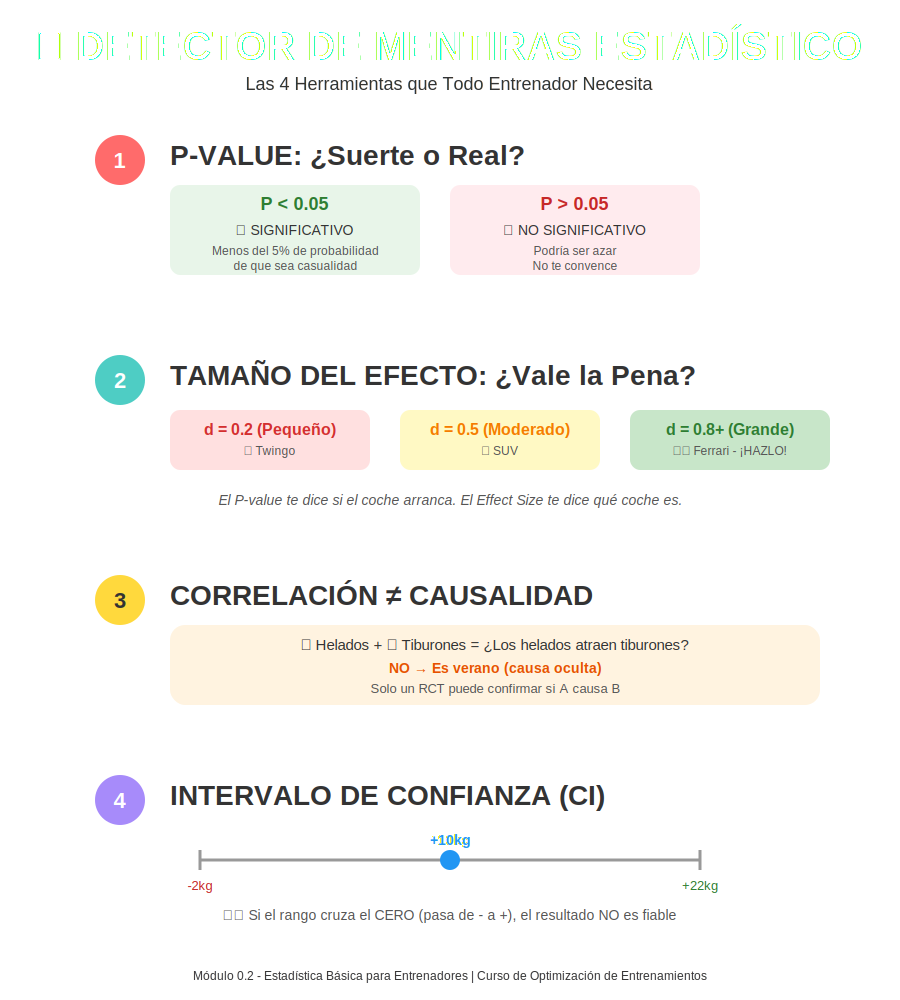

# Tema 0.2: Estadística Básica para Entrenadores

## Introducción: Tu Detector de Mentiras Matemático

Imagina que la estadística es como las gafas de sol en una playa muy brillante. Sin ellas, el sol (los datos desordenados) te ciega y no ves nada. Con ellas, ves los contornos claros de la realidad.
No necesitas ser matemático para ser un gran entrenador, pero necesitas estadística básica para que no te vendan humo.

> Apoyo visual: [Infografía "Tu Brújula Científica"](infografia_brujula_cientifica.md) — resume P-value vs Tamaño del Efecto.

## 1. P-value: ¿Fue Suerte o Fue Real?

Imagina que lanzas una moneda 10 veces y salen 10 caras. ¿La moneda está trucada o tuviste una suerte increíble? El **P-value** calcula esa probabilidad de "suerte".

* **La Regla del 0.05**: En ciencia, somos escépticos. Solo creemos algo si la probabilidad de que sea "azar" es menor al 5% (0.05).
  * **P < 0.05**: "Es muy improbable que sea suerte. Probablemente es real". (**Significativo**).
  * **P > 0.05**: "Podría haber sido casualidad. No me convence". (**No Significativo**).

**¡Cuidado!**: "Significativo" en estadística NO significa "Importante" en la vida real. Solo significa "Real".

## 2. Tamaño del Efecto (Effect Size): ¿Vale la Pena?

Aquí es donde separamos lo "real" de lo "útil".

* Si un quemador de grasa te hace perder 50 gramos en un año, y el estudio es sólido, es un resultado "Significativo" (es real).
* Pero, ¿te importa perder 50 gramos en un año? No. Aquí entra el **Tamaño del Efecto**.

| Valor (Cohen's d) | Traducción | ¿Me importa? |
| :--- | :--- | :--- |
| **0.2** | Pequeño | Probablemente no, a menos que seas olímpico. |
| **0.5** | Moderado | Interesante, vale la pena probar. |
| **0.8+** | Grande | **¡Hazlo!** Esto cambia resultados visiblemente. |

**Analogía**: El P-value te dice si el coche arranca. El Effect Size te dice si es un Ferrari o un Twingo.

## 3. Correlación vs. Causalidad: El Clásico Error

* **Hecho**: En verano, aumentan las ventas de helados y aumentan los ataques de tiburones.
* **Conclusión Errónea**: "Comer helado atrae tiburones". (Causalidad falsa).
* **Realidad**: Es verano. La gente va más a la playa (causa oculta).

En Fitness:

* "La gente con grandes gemelos entrena sin zapatos" -> ¿Entrenar descalzo hace crecer los gemelos? ¿O la gente con buena genética prefiere entrenar descalza?
* **Solo un experimento controlado (RCT)** puede confirmar si A causa B.

## 4. Intervalo de Confianza (CI): El Rango de la Verdad

Los estudios nunca te dan un número exacto, te dan un "tiro al blanco".

* *Estudio*: "La Creatina aumenta la fuerza: **10kg (CI: -2kg a 22kg)**".
* *Traducción*: "Estamos 95% seguros de que el efecto está entre perder 2kg y ganar 22kg".
  * **¡ALERTA!**: Si el rango cruza el CERO (pasa de negativo a positivo), significa que ¡existe la posibilidad de que no haga NADA o incluso reste! Ese resultado no es fiable, aunque el promedio pinte bien.

---

### Resumen Rápido

1. **P < 0.05**: Es real, no suerte.
2. **Effect Size Grande**: Es útil, no solo real.
3. **Correlación**: Solo dice que van de la mano, no que uno empuja al otro.
4. **Intervalo de Confianza**: Si cruza el cero, duda.
