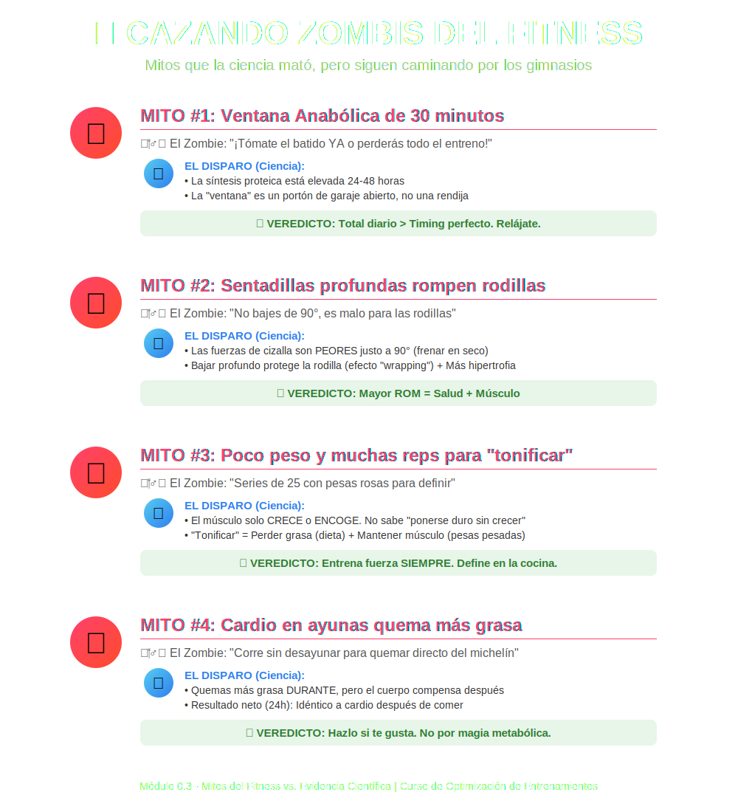

# Tema 0.3: Mitos del Fitness vs. Evidencia Científica

## Introducción: Cazando Zombis

La industria del fitness está llena de "zombis": ideas que la ciencia mató y enterró hace años, pero que siguen caminando por los gimnasios asustando a la gente. Vamos a agarrar nuestra escopeta de evidencia (Papers y Meta-análisis) y a limpiar el terreno.

## Mito 1: "La Ventana Anabólica de 30 minutos"
>
> *"¡Rápido! ¡Tómate el batido o perderás todo el entreno!"*

* **El Zombie**: La idea de que el cuerpo cierra la fábrica de músculo 30 minutos después de la última repetición.
* **El Disparo (Ciencia)**:
  * La síntesis de proteínas (la construcción de músculo) se mantiene elevada **24 a 48 horas**.
  * La "ventana" no es una rendija minúscula, es un **portón de garaje abierto de par en par**.
  * *Contexto*: Si entrenas en ayunas total, comer pronto es importante. Si comiste hace 2-3 horas, tienes aminoácidos nadando en tu sangre todavía.
* **Veredicto**: Relájate. Come bien durante el día. Total diario > Timing perfecto.

## Mito 2: "Sentadillas profundas rompen rodillas"
>
> *"No bajes de 90 grados, es malo."* - Entrenador anclado en 1990.

* **El Zombie**: La creencia de que la flexión profunda es lesiva.
* **El Disparo (Ciencia)**:
  * Las fuerzas de cizalla (las que "tiran" del ligamento cruzado) son **peores justo a los 90 grados**. Frenar en seco ahí es más estresante que bajar fluido.
  * Al bajar profundo ("Ass to Grass"), los isquios y gemelos ayudan a estabilizar (efecto "wrapping"), protegiendo la rodilla.
  * *Bonus*: A mayor rango de movimiento (ROM), más hipertrofia.
* **Veredicto**: Si tu movilidad te deja, bajar es **salud** y **músculo**.

## Mito 3: "Poco peso y muchas reps para 'tonificar'"
>
> *"Quiero definir, así que haré series de 25 con las pesas rosas."*

* **El Zombie**: Creer que el músculo tiene dos interruptores: "Crecer" y "Tonificar".
* **El Disparo (Ciencia)**:
  * El músculo solo sabe hacer dos cosas: **Crecer (hipertrofia)** o **Encogerse (atrofia)**. No sabe "ponerse duro pero no grande".
  * "Tonificar" es simplemente: **Perder grasa (Dieta) + Mantener músculo (Pesas pesadas)**.
  * Si haces muchas reps con poco esfuerzo en déficit calórico, le dices a tu cuerpo: *"No necesitamos este músculo costoso para sobrevivir"*. Y lo quemas.
* **Veredicto**: Entrena para fuerza/hipertrofia SIEMPRE. La definición se hace en la cocina.

## Mito 4: "Cardio en ayunas quema más grasa"
>
> *"Sal a correr sin desayunar para quemar directo del michelín."*

* **El Zombie**: Fisiología simplista de "insulina baja = quema grasa".
* **El Disparo (Ciencia)**:
  * Es verdad que quemas más grasa *durante* la carrera.
  * **PERO**: Tu cuerpo es listo. Si quemas mucha grasa en la mañana, compensará quemando más carbohidratos (y guardando grasa) el resto del día.
  * **Resultado Neto (24h)**: Es idéntico a cardio comido.
* **Veredicto**: Hazlo si te gusta o te ahorra tiempo. No lo hagas por magia metabólica.

---

### Resumen Anti-Zombis

1. **Proteína**: El total del día manda.
2. **Sentadillas**: Profundas son seguras (si tienes técnica).
3. **Tonificar**: Es un mito. Entrena pesado, come ligero.
4. **Ayuno**: Herramienta de preferencia, no de superioridad.
