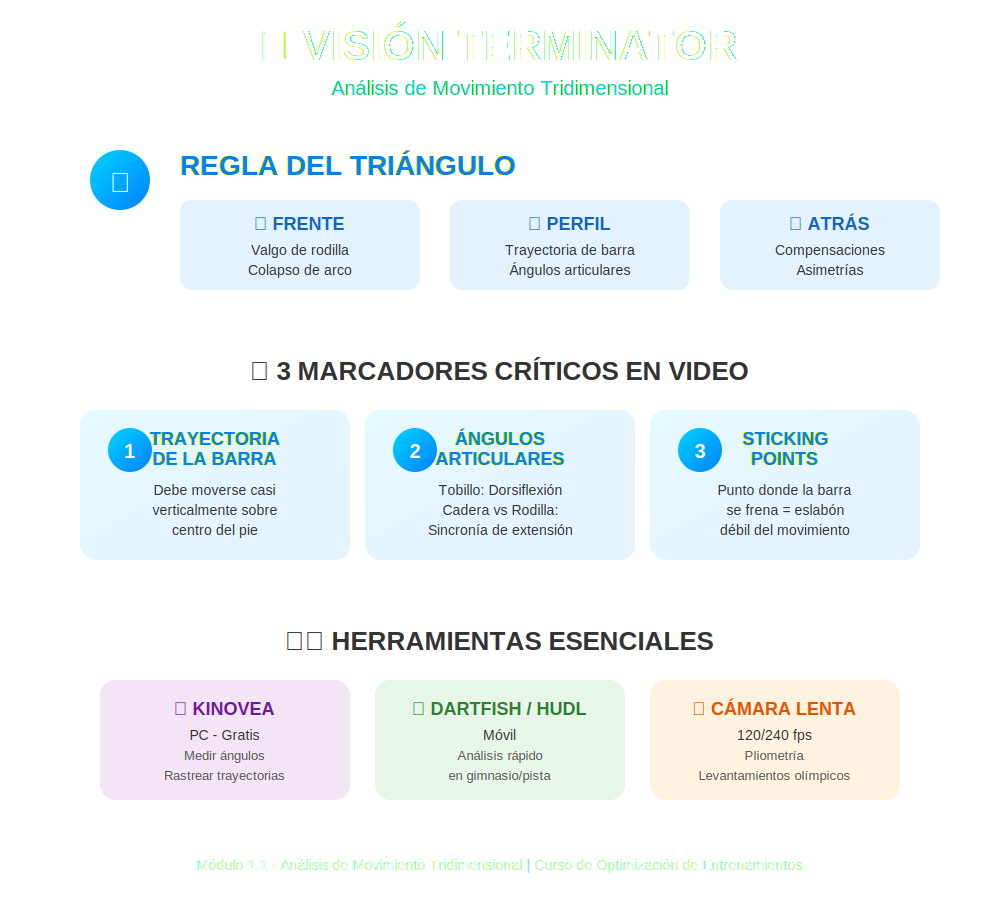

# Tema 1.1: Análisis de Movimiento Tridimensional y Video Análisis

## Introducción: Ojos de Terminator

La mayoría de entrenadores miran a un cliente y dicen: *"Mmm, algo se ve raro"*.
Tú vas a aprender a mirar con "visión de Terminator": superponiendo líneas, ángulos y vectores sobre la imagen real.
Ya no adivinamos. Medimos.

En este tema, pasamos de los planos básicos a herramientas del siglo XXI.

## 1. Más allá de los 3 Planos (La Realidad es 3D)

Ya conoces Sagital, Frontal y Transversal. El problema es que **nadie se mueve robóticamente en un solo plano**.

* *La Sentadilla*: No es solo flexión sagital. Hay abducción de cadera (frontal) y rotación externa (transversal).
* *El Error*: Analizar una sentadilla solo de lado (perfil) te oculta el 66% de la información crítica (valgo de rodilla, colapso de arco plantar).

**La Regla del Triángulo**: Para un análisis real, necesitas filmar o ver desde al menos **dos ángulos** (Frente y Perfil), idealmente tres (Atrás también).

## 2. Herramientas de Video Análisis (Tu Laboratorio de Bolsillo)

El ojo humano es lento (captura ~30 fps y el cerebro procesa menos). Muchos fallos biomecánicos ocurren en milisegundos.
Necesitas tecnología.

### Apps y Software Esenciales (y Gratuitos)

1. **Kinovea** (PC - Gratis): El estándar de oro. Permite medir ángulos, rastrear trayectorias y comparar videos lado a lado.
2. **Dartfish / Hudl Technique** (Móvil): Para análisis rápido en pista/gimnasio.
3. **Cámara Lenta del Móvil**: Graba a 120/240 fps. Vital para ver pliometría o levantamientos olímpicos.

## 3. Qué Buscar en el Video (Protocolo de Análisis)

No grabes por grabar. Busca sistemáticamente estos 3 marcadores:

### A. La Trayectoria de la Barra (Bar Path)

* En levantamientos de fuerza (Squat, Deadlift, Bench), la barra debe moverse casi verticalmente sobre el centro del pie (mid-foot).
* **Signo de Alarma**: Si la línea de la barra se desplaza hacia adelante en la sentadilla, el cliente está perdiendo eficiencia y aumentando cizalla lumbar.

### B. Ángulos Articulares Críticos

* **Tobillo (Dorsiflexión)**: ¿La tibia avanza? Si se detiene y el talón se levanta, tienes una restricción de movilidad.
* **Cadera vs. Rodilla**: En el despegue del Peso Muerto, ¿se extienden al mismo tiempo? O... ¿la cadera sube primero ("stripper pull")? El video lo revela al instante.

### C. Velocidad y "Sticking Points"

* El punto donde la barra se frena drásticamente es tu "eslabón débil".
* *Ejemplo*: Si la barra se frena a mitad de la subida en Banca, es debilidad de tríceps. Si se pega al pecho, es pectoral/deltoides.

## 4. Práctica: Tu Primer Análisis Virtual

Imagina que grabas a un cliente haciendo Sentadilla Frontal.

1. **Traza una línea vertical** desde la barra hacia el suelo.
2. **Resultado**: La línea cae sobre los dedos de los pies, no sobre el mediopié.
3. **Diagnóstico Biomecánico**: El centro de masa está adelantado.
4. **Causa Probable**: Falta de movilidad torácica (se encorva) o falta de dorsiflexión.
5. **Intervención**: Mejora la movilidad antes de subir el peso.

---

### Resumen

* El ojo engaña, el video no.
* Usa cámara lenta para movimientos rápidos.
* Analiza la **trayectoria de la barra** y los **ángulos límite**.
* No confíes en un solo ángulo de visión.
