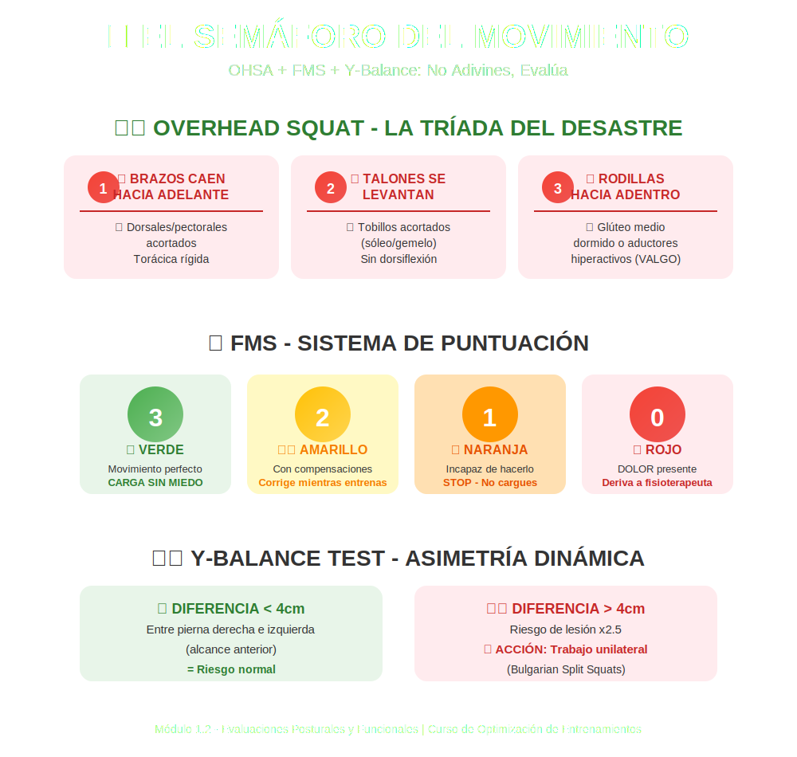

# Tema 1.2: Evaluaciones Posturales y Funcionales (OHSA, FMS, Y-Balance)

## Introducción: No Adivines, Evalúa

Si fueras un mecánico de F1, ¿ajustarías el motor sin mirar la telemetría? No.
Entonces, ¿por qué diseñas rutinas sin saber si tu cliente tiene el tobillo bloqueado o la cadera desviada?
Las evaluaciones no son para "diagnosticar lesiones" (eso es de fisios), son para **detectar limitaciones de movimiento** que harán que tu entrenamiento sea ineficiente o peligroso.

## 1. Overhead Squat Assessment (OHSA) - El "Escaner" Rápido

La Sentadilla de Arranque (brazos arriba) es el test definitivo. En 5 repeticiones te dice casi todo lo que necesitas saber.

### Protocolo

* Pies ancho de hombros, brazos extendidos arriba, mirada al frente.
* Instrucción: "Haz una sentadilla profunda manteniendo los brazos arriba".

### Qué Buscar (La "Tríada del Desastre")

1. **Los brazos caen hacia adelante**:
    * *Traducción*: Tus dorsales o pectorales están acortados, o tu espalda alta (torácica) está rígida como una tabla.
2. **Los talones se levantan**:
    * *Traducción*: Tus tobillos (sóleo/gemelo) están acortados. No tienes dorsiflexión.
3. **Rodillas hacia adentro (Valgo)**:
    * *Traducción*: Glúteo medio dormido o aductores hiperactivos. Es una bomba de tiempo para el ligamento cruzado.

## 2. Functional Movement Screen (FMS) - El Semáforo

El FMS es un sistema de 7 pruebas puntuadas (0 a 3). No necesitas ser certificado para usar sus conceptos clave:

* **3 (Semáforo Verde)**: Movimiento perfecto. Carga sin miedo.
* **2 (Semáforo Amarillo)**: Movimiento aceptable con compensaciones. Corrige mientras entrenas.
* **1 (Semáforo Naranja)**: Incapaz de hacer el movimiento. **STOP**. No cargues peso aquí hasta arreglarlo.
* **0 (Semáforo Rojo)**: DOLOR. Deriva al fisioterapeuta. Tú no tocas eso.

## 3. Y-Balance Test - Asimetría Dinámica

La mayoría de la gente es más fuerte o estable de un lado. El Y-Balance lo cuantifica.

* El atleta se para en un pie y empuja una caja (o simplemente alcanza) en 3 direcciones (Anterior, Posteromedial, Posterolateral).
* **La Regla de Oro**: Si hay una diferencia de **más de 4cm** entre la pierna derecha y la izquierda (alcance anterior), el riesgo de lesión se dispara x2.5.
* **Acción**: Si detectas asimetría, tu prioridad #1 es el trabajo unilateral (Bulgarian Split Squats) hasta igualar.

## Conclusión

La evaluación dicta el programa.

* Si falla el OHSA (brazos caen) -> Mucho remo y movilidad torácica.
* Si falla el Y-Balance (asimetría) -> Trabajo a una pierna.
* Sin evaluación, estás tirando dardos con los ojos vendados.
