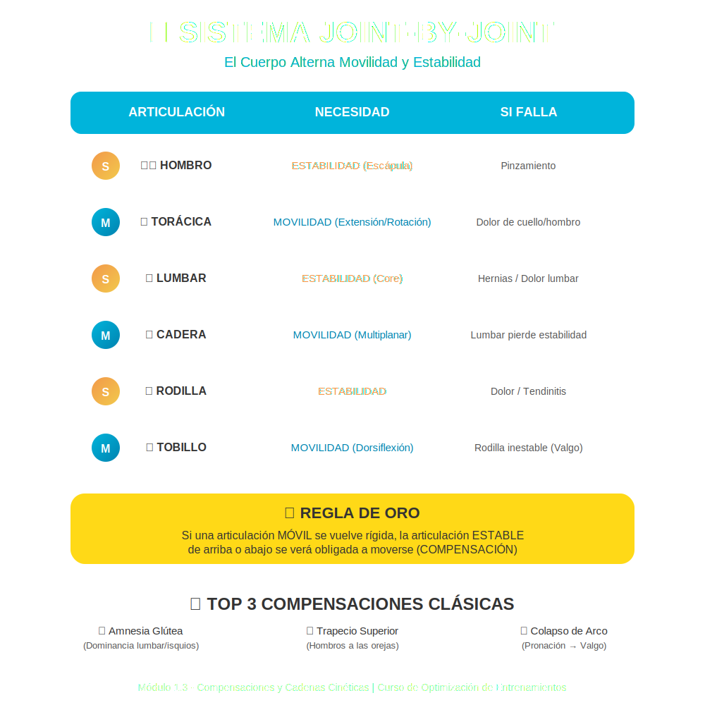

# Tema 1.3: Detección de Compensaciones y Cadenas Cinéticas

## Introducción: El Cuerpo es un Equipo de Trabajo

Imagina una oficina donde el "Jefe" (Glúteo) se va a dormir y le pasa todo el trabajo al "Becario" (Isquiotibial/Lumbar).
El Becario se quema (lesión) y se queja.
Si tú (el entrenador/médico) tratas al Becario dándole masajes pero no despiertas al Jefe... el problema volverá mañana.
Esto es la **Dominancia Sinérgica**. Y es la causa #1 de dolor no traumático en el gimnasio.

## 1. El Concepto "Joint-by-Joint" (Articulación por Articulación)

Mike Boyle y Gray Cook nos dieron este mapa del tesoro. El cuerpo alterna articulaciones que necesitan **MOVILIDAD** y las que necesitan **ESTABILIDAD**.

| Articulación | Necesidad Primaria | Qué pasa si falla |
| :--- | :--- | :--- |
| **Tobillo** | **Movilidad** (Dorsiflexión) | La rodilla se vuelve inestable (Valgo). |
| **Rodilla** | **Estabilidad** | Dolor de rodilla (tendinitis). |
| **Cadera** | **Movilidad** (Multiplanar) | La lumbar pierde estabilidad y se mueve. |
| **Lumbar** | **Estabilidad** (Core) | Hernias / Dolor bajo espalda. |
| **Torácica** | **Movilidad** (Extensión/Rotación) | El hombro pierde estabilidad / Dolor cuello. |
| **Hombro** | **Estabilidad** (Escápula) | Pinzamiento (Impingement). |

**Regla de Oro**: Si una articulación móvil se vuelve rígida (ej. tobillo rígido), la articulación estable de arriba o abajo se verá obligada a moverse para compensar (ej. rodilla inestable).

## 2. Compensaciones Clásicas (El "Top Hits" de los Errores)

### A. La Amnesia Glútea (Dominancia de Isquios/Lumbar)

* **El Problema**: En la extensión de cadera (ej. final del Peso Muerto), el glúteo debería ser el motor principal. Si está inhibido (por estar sentado todo el día), los isquios y la lumbar toman el control.
* **Síntoma**: Dolor lumbar o tirones en el isquio, *no* agujetas en el glúteo.
* **Solución**: Activación aislada de glúteo (Puente Glúteo) ANTES de cargar peso.

### B. Dominancia del Trapecio Superior

* **El Problema**: Al hacer press de hombro o elevaciones laterales, el cliente encoge los hombros hacia las orejas.
* **Causa**: Trapecio superior hiperactivo, Trapecio inferior/Serrato débil.
* **Resultado**: Dolor de cuello y pinzamiento de hombro.

### C. Colapso de Arco Plantar (Pronación)

* **El Problema**: El pie se "derrumba" hacia adentro.
* **Cadena de Desastre**: Pie pronado -> Tibia rota internamente -> Rodilla en Valgo -> Fémur rota internamente -> Cadera inestable.
* **Solución**: No mires solo la rodilla, ¡mira el pie! (Short foot exercise).

## 3. Cómo Detectarlas en Tiempo Real

No necesitas rayos X. Usa tus ojos y manos (con permiso).

1. **Palpación**: En un puente de glúteo, toca el glúteo y el isquio. ¿Cuál se pone duro primero? Debería ser el glúteo.
2. **Observación**: ¿Se mueve lo que debe estar quieto? (Ej. lumbar arqueándose en un Press Militar).

## Conclusión

Tu trabajo como entrenador es **restaurar la función original**.
Devuelve la movilidad a los tobillos y caderas. Devuelve la estabilidad a las rodillas y lumbares. El dolor desaparecerá "mágicamente".
