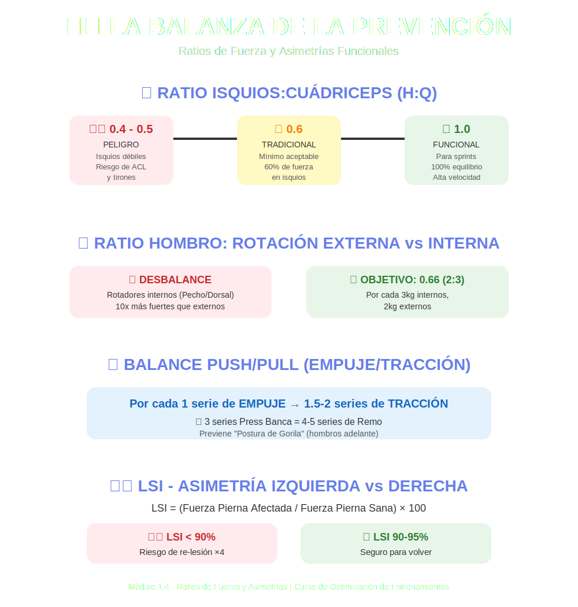

# Tema 1.4: Análisis de Ratios de Fuerza y Asimetrías Funcionales

## Introducción: La Biomecánica de la Balanza

Si tu coche tiene los frenos traseros el doble de potentes que los delanteros, te estrellarás en la primera curva.
El cuerpo humano funciona igual. No basta con ser fuerte; hay que ser fuerte **en proporción**.
En este tema, aprendemos la matemática de la prevención de lesiones: los Ratios de Fuerza.

## 1. El Ratio Isquios:Cuádriceps (H:Q Ratio)

Históricamente, el ratio más estudiado por su relación con roturas de ACL (Cruzado Anterior) y tirones de isquios.

* **Definición**: Cuánta fuerza tienen tus isquios (flexión de rodilla) comparado con tus cuádriceps (extensión de rodilla).
* **El Número Mágico**:
  * **Tradicional**: 0.6 (60%). O sea, tus isquios deben levantar al menos el 60% que tus cuádriceps.
  * **Funcional (Rápido)**: En movimientos rápidos (sprint), queremos acercarnos al **1.0 (100%)**.
* **El Problema**: La mayoría de gimnasios tienen muchas máquinas de extensión de cuádriceps y pocas de curl femoral decente. Resultado: Atletas con ratio 0.4.
* **Consecuencia**: En un sprint, el cuádriceps patea la tibia con tanta fuerza que el isquio débil no puede frenarla... y *¡CLACK!* Adios cruzado.

## 2. Ratios de Hombro: Rotación Externa vs. Interna

El hombro es la articulación más móvil y la más inestable.

* **Rotadores Internos** (Pectoral, Dorsal, Subescapular): **Los Gigantes**. Los entrenamos siempre (Press Banca, Dominadas).
* **Rotadores Externos** (Infraespinoso, Redondo Menor): **Los Enanos**. Nadie los entrena.
* **El Riesgo**: Si los Gigantes son 10 veces más fuertes que los Enanos, el húmero se rota internamente de forma crónica.
* **Objetivo**: Buscar un ratio cercano a **0.66 (2:3)**. Por cada 3kg de fuerza interna, deberías tener 2kg de fuerza externa. Si empujas 100kg en banca, deberías poder hacer un Facepull o Rotación externa decente (no con 2kg).

## 3. Balance Push/Pull (Empuje/Tracción)

Una regla simple para programar y evitar la "Postura de Gorila" (hombros adelante, espalda encorvada):

> **Por cada serie de Empuje (Push), programa 1.5 o 2 series de Tracción (Pull).**

* ¿Hiciste 3 series de Press Banca? Haz 4-5 series de Remo.
* ¿Por qué? Porque vivimos sentados frente a ordenadores (flexión y rotación interna). El gimnasio debe **contrarrestar** la vida, no agravarla.

## 4. Asimetría Izquierda vs. Derecha (LSI - Limb Symmetry Index)

Después de una lesión (ej. operación de rodilla), ¿cuándo volver a competir o entrenar duro?

* **LSI**: (Fuerza Pierna Afectada / Fuerza Pierna Sana) x 100.
* **Meta**: > **90-95%**.
* Si tu pierna operada tiene solo el 80% de la fuerza de la sana, tienes un **riesgo de re-lesión x4**.

## Resumen

La fuerza absoluta impresiona en Instagram.
La fuerza relativa y balanceada te mantiene entrenando 20 años sin dolor.
Equilibra tu balanza.
