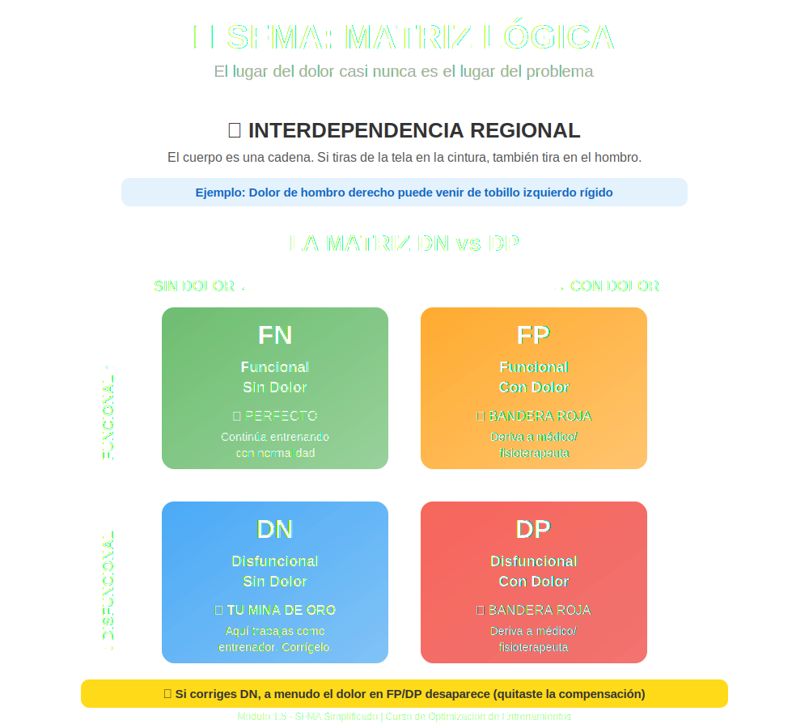

# Tema 1.5: Evaluación de Movilidad Específica (SFMA Simplificado)

## Introducción: ¿Doler o no Doler?

El FMS (que vimos antes) es un *semáforo* para saber si puedes cargar peso.
El **SFMA (Selective Functional Movement Assessment)** es el *diagnóstico* para saber POR QUÉ te mueves mal cuando tienes dolor o disfunción.

Su filosofía rompe cabezas:
> **"El lugar del dolor casi nunca es el lugar del problema."**

Si te duele la rodilla, el culpable suele ser el tobillo o la cadera. El SFMA busca al culpable, no a la víctima.

## 1. El Concepto de "Interdependencia Regional"

El cuerpo es una cadena.

* Imagina que llevas una camiseta ajustada. Si tiras de la tela en la cintura, te tirará también en el hombro.
* Si tratas el hombro, no arreglas nada. El tirón viene de la cintura.
* **Ejemplo Real**: Un dolor de hombro derecho puede venir de un tobillo izquierdo rígido que altera toda tu forma de caminar y transmitir fuerzas.

## 2. Desglosando el Movimiento: El "Top Tier"

El SFMA usa movimientos globales para ver dónde fallas. El más famoso es el **Multi-Segmental Flexion** (Tocar la punta de los pies).

### El Caso del "No llego a mis pies"

Intentas tocarte los pies y te quedas a 20cm.

* **Diagnóstico de Gimnasio**: "Tengo los isquios cortos".
* **Diagnóstico SFMA**: "Depende".
  * Para tocar tus pies necesitas:
        1. Flexión de cadera.
        2. Flexión lumbar.
        3. Desplazamiento de peso posterior (Weight shift).
        4. Relajación de pantorrillas.
        5. Control neural (saber hacerlo).

Si tu lumbar está bloqueada, tus isquios tendrán que estirarse el doble. Se quejarán y se tensarán para protegerte. Si estiras los isquios, ¡empeoras el problema! El problema era lumbar.

## 3. DN vs DP (La Matriz Lógica)

Cuando evalúas un movimiento, lo clasificas en una de 4 cajas:

1. **FN (Functional Non-painful)**: Funcional y Sin Dolor. Perfecto.
2. **FP (Functional Painful)**: Lo haces bien, pero duele. (Bandera Roja -> Méd/Fisio).
3. **DP (Dysfunctional Painful)**: Lo haces mal y duele. (Bandera Roja -> Méd/Fisio).
4. **DN (Dysfunctional Non-Painful)**: **TU MINA DE ORO**.
    * Lo haces mal, pero NO duele.
    * **Aquí es donde trabajas como entrenador**.
    * Si corriges estos movimientos "feos pero indoloros", a menudo el dolor en otras zonas (FP/DP) desaparece porque quitaste la compensación.

## 4. Breakouts (Desglosando el Problema)

Si fallas en tocar los pies de pie (Cargado), te tumbamos y te pedimos llevar las rodillas al pecho (Descargado).

* Si tumbado **SÍ** puedes flexionar -> No es problema muscular ni articular. Es problema de **Control Motor** (Tu cerebro no sabe coordinar la estabilidad de pie).
* Si tumbado **TAMPOCO** puedes -> Es problema de Tejido (Músculo corto o articulación bloqueada).

## Resumen

No asumas que "falta flexibilidad" siempre es músculo corto.
A veces es el cerebro poniendo el freno de mano porque no se siente estable.
El SFMA nos ayuda a diferenciar **Problema de Software (Control)** vs. **Problema de Hardware (Tejido)**.
