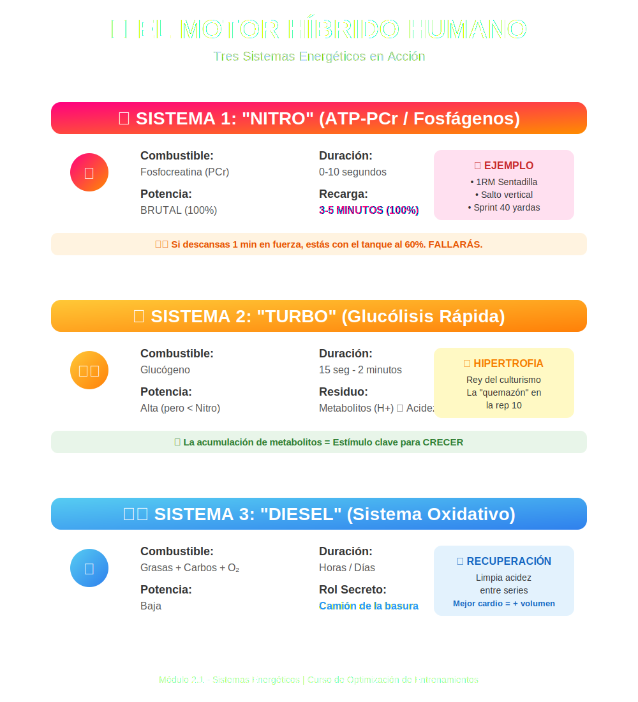

# Tema 2.1: Sistemas Energéticos (El Motor Híbrido Humano)

## Introducción: No eres un Tesla, eres un Híbrido

Tu cuerpo funciona como un coche híbrido complejo que tiene tres motores bajo el capó. No "cambia de marcha" bruscamente; más bien mezcla el uso de los tres constantemente. Entender esto es la diferencia entre descansar lo necesario o fallar el levantamiento por impaciente.
La moneda de cambio del cuerpo es el **ATP** (Adenosín Trifosfato). Sin ATP, te quedas rígido (rigor mortis).

## 1. Los Tres Motores

### 1.1 El "Nitro" (Sistema de los Fosfágenos / ATP-PCr)

- **El Combustible**: Fosfocreatina (guardada en el músculo).
- **Potencia**: Brutal (100%).
- **Duración del Tanque**: Muy corta (**0 a 10 segundos**).
- **Ejemplo**: Un 1RM de Sentadilla, un salto vertical, un sprint de 40 yardas.
- **La Recarga**: Aquí está la clave para fuerza. Tarda **3 a 5 minutos** en llenarse al 100%.
  - _Si descansas 1 minuto en una serie de fuerza, estás intentando hacer un récord con el tanque al 60%. Fallarás._

### 1.2 El "Turbo" (Glucólisis Rápida / Anaeróbico Láctico)

- **El Combustible**: Glucógeno (Carbohidrato almacenado).
- **Potencia**: Alta (pero menor que el Nitro).
- **Duración del Tanque**: **15 segundos a 2 minutos**.
- **El Residuo ("Humo")**: Genera metabolitos (H+) que causan **acidez**. Esa sensación de "quemazón" en la repetición 10 de Extensiones de Cuádriceps es el Turbo ahogándose en su propio humo.
- **Rol en Hipertrofia**: Es el rey del culturismo. La acumulación de metabolitos es un estímulo clave para crecer.

### 1.3 El "Diesel" (Sistema Oxidativo / Aeróbico)

- **El Combustible**: Grasas (principalmente) y Carbohidratos + OXÍGENO.
- **Potencia**: Baja.
- **Duración del Tanque**: Horas/Días.
- **El Secreto**: Muchos culturistas ignoran el cardio, pero el Sistema Aeróbico es el **camión de la basura**. Es el encargado de limpiar la acidez (lactato/H+) **durante el descanso entre series**.
  - _Mejor capacidad aeróbica = Recuperación más rápida entre series = Más volumen total de calidad._

## 2. Ratios de Trabajo:Descanso (La Guía Práctica)

No descanses por instinto, descansa por fisiología.

| Objetivo                 | Sistema Dominante   | Ratio Trabajo:Descanso | Ejemplo                          |
| :----------------------- | :------------------ | :--------------------- | :------------------------------- |
| **Fuerza / Potencia**    | Nitro (ATP-PCr)     | **1:12 a 1:20**        | Esfuerzo 5s -> Descanso 3-5 min. |
| **Hipertrofia**          | Turbo (Glucolítico) | **1:3 a 1:5**          | Serie 40s -> Descanso 2-3 min.   |
| **Resistencia Muscular** | Diesel/Mixto        | **1:1 a 1:2**          | Serie 60s -> Descanso 60s.       |

## 3. El Mito del "Switch"

Crees que cuando pasas los 10 segundos, el sistema de fosfágenos se apaga. **Falso**.
Es un **Dimmer (Atenuador)**, no un Switch.
En una serie de 8 repeticiones:

1. **Reps 1-2**: 90% Fosfágenos / 10% Glucólisis.
2. **Reps 5-6**: 50% Fosfágenos / 50% Glucólisis.
3. **Reps 8**: 10% Fosfágenos / 70% Glucólisis / 20% Oxidativo (ayudando desesperadamente).

## Conclusión

Si quieres ser fuerte, ten paciencia (recarga el Nitro).
Si quieres ser grande, aprende a tolerar la quemazón (usa el Turbo).
Y si quieres aguantar el entrenamiento entero, no descuides tu cardio (cuida el Diesel).
