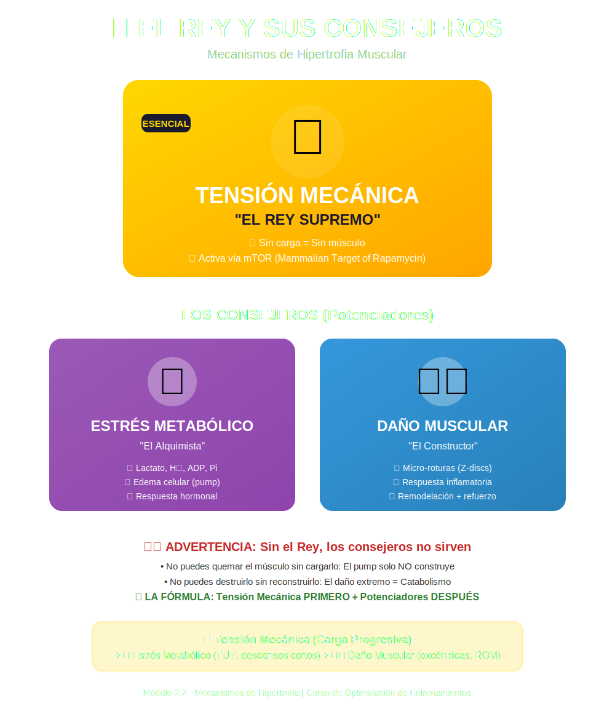

# Tema 2.2: Mecanismos de Hipertrofia (¿Por qué crece el músculo?)

## Introducción: El Rey y sus Consejeros

Durante años, se pensó que había tres vías "iguales" para crecer: Tensión Mecánica, Estrés Metabólico y Daño Muscular.
La ciencia moderna (2023-2025) ha actualizado este modelo. Ahora sabemos que es una monarquía.
**La Tensión Mecánica es el REY ABSOLUTO.** Los otros dos son consejeros que ayudan, pero si el Rey no está, no hay reino.

## 1. Tensión Mecánica (El Rey)

Es la fuerza que intentan generar las fibras musculares para resistir una carga.

* **La Clave**: No es solo "cargar pesado". Es cargar un peso y moverlo a través de un rango de movimiento completo, reclutando las fibras de alto umbral.
* **Fibras de Alto Umbral**: Son las fibras rápidas (Tipo II), las que tienen mayor potencial de crecimiento. Solo se activan cuando la carga es muy pesada (1-5RM) O cuando estás cerca del fallo con cargas moderadas.
* **El Estímulo**: Los mecanosensores en la célula detectan este estiramiento bajo tensión y activan la vía **mTOR** (la señal de "¡Construye más proteína!").

## 2. Estrés Metabólico (El Consejero del "Pump")

Es la acumulación de metabolitos (lactato, fosfato inorgánico, H+) producida por la glucólisis (el motor "Turbo").

* **Sensación**: Es el "bombeo" o "pump".
* **¿Cómo ayuda al Rey?**: La fatiga metabólica obliga al cuerpo a reclutar las fibras de alto umbral antes de tiempo. Si haces repeticiones altas, las fibras pequeñas se cansan y el cerebro llama a las grandes para seguir.
* **Mito**: Perseguir *solo* el bombeo con pesas rosas no genera suficiente tensión mecánica para optimizar el crecimiento. El bombeo sin tensión es efímero.

## 3. Daño Muscular (El Consejero Peligroso)

Son las micro-roturas en las miofibrillas (especialmente la línea Z).

* **Sensación**: DOMS (Agujetas) a las 24-48h.
* **¿Necesario?**: **NO**.
* **La Actualización**: Antes creíamos que "romper para construir" era la ley. Ahora sabemos que *algo* de daño es inevitable, pero buscar el daño excesivo (no poder caminar tras el día de pierna) es **contraproducente**.
  * Si hay mucho daño, el cuerpo gasta energía en *reparar* (volver a cero) en lugar de *crecer* (superar cero).
  * **Hipertrofia sin dolor**: Es posible y deseable progresar sin estar siempre adolorido.

## 4. La Receta Práctica (Drivers de Hipertrofia)

Si la Tensión es el Rey, ¿cómo la maximizamos?

1. **Sobrecarga Progresiva**: Añadir peso o repeticiones a lo largo del tiempo.
2. **Rango de Movimiento Completo (ROM)**: Estirar el músculo bajo carga (fase excéntrica) es muy anabólico.
3. **Proximidad al Fallo (RIR/RPE)**: Las series deben terminar cerca del fallo (RIR 0-3) para asegurar que las fibras de alto umbral recibieron la tensión.

## Resumen

Deja de buscar agujetas como señal de un buen entreno.
Deja de buscar solo el bombeo.
Busca **Tensión Mecánica Progresiva**: Mover cargas desafiantes, con control, cerca del fallo, y superarte cada semana.
