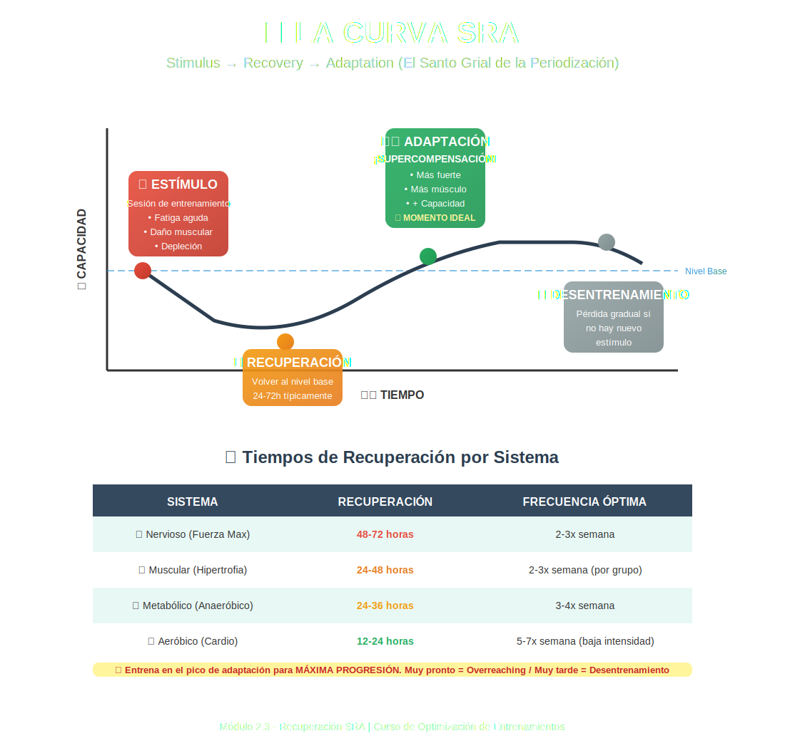

# Tema 2.3: Recuperación y Curva SRA

## Introducción: No creces en el Gimnasio

En el gimnasio lo único que haces es cavar un hoyo.
Cuanto más duro entrenas, más profundo es el hoyo (Fatiga).
Para construir una montaña más alta que antes (Supercompensación), primero tienes que rellenar el hoyo (Recuperación).
Este proceso se llama **Curva SRA (Stimulus-Recovery-Adaptation)**.

## 1. Las Fases de la Curva SRA

1. **Estímulo (Entrenamiento)**:
   - Generas fatiga, daño y vaciado de glucógeno. Tu capacidad de rendimiento BAJA inmediatamente después de entrenar. Eres más débil al salir del gym que al entrar.
2. **Recuperación**:
   - Comida, Sueño, Descanso. El cuerpo rellena el hoyo. Vuelves a tu nivel base (Homeostasis).
3. **Adaptación (Supercompensación)**:
   - El cuerpo dice: _"Eso fue duro, mejor me fortalezco por si vuelve a pasar"_.
   - Tu capacidad sube por ENCIMA del nivel base. **Aquí es donde te vuelves más fuerte/grande**.
4. **Involución (Desentrenamiento)**:
   - Si no vuelves a entrenar en este pico, pierdes la adaptación y vuelves a bajar.

## 2. Timing Perfecto: ¿Cuándo volver a entrenar?

El arte del entrenador es acertar con el momento del siguiente estímulo.

- **Demasiado pronto (Antes de recuperarse)**: Cavas el hoyo más profundo antes de rellenarlo. -> **Sobreentrenamiento**.
- **Demasiado tarde (Después de la involución)**: Vuelves a la base. Entrenas siempre igual, estás estancado. -> **Mantenimiento**.
- **Momento Óptimo (En la cima de la adaptación)**: Encadenas picos de supercompensación. -> **Progreso Exponencial**.

## 3. Tiempos de Recuperación por Sistema

No todo se recupera a la vez. Esto es vital para la frecuencia de entrenamiento.

| Sistema                                  | Tiempo Promedio de Recuperación                              |
| :--------------------------------------- | :----------------------------------------------------------- |
| **Sistemas Energéticos (ATP/Glucógeno)** | 24 - 48 horas (con comida adecuada).                         |
| **Músculo (Daño estructural)**           | 48 - 72 horas (depende del volumen y grupo muscular).        |
| **Sistema Nervioso (SNC)**               | 48 - 96+ horas (después de fuerza máxima o fallos brutales). |
| **Tendones y Articulaciones**            | Semanas / Meses (tienen poco riego sanguíneo).               |

- _Implicación_: Puedes sentir los músculos frescos a las 24h, pero tu Sistema Nervioso sigue "frito". Si intentas otro récord personal, te lesionarás o fallarás.

## 4. Frecuencia Óptima

Debido a la curva SRA típica de la hipertrofia (aprox 48-72h):

- Frecuencia 1 (Bro-split: Pecho Lunes, esperar al lunes sgte): **Subóptima**. Pierdes la ventana de supercompensación a mitad de semana.
- Frecuencia 2 (Torso/Pierna o Fullbody): **Óptima**. Golpeas el músculo cada 3-4 días, justo en su pico de adaptación.

## Resumen

Gestionar la fatiga es gestionar el éxito.
No eres vago por descansar, eres estratégico.
Si entrenas cuando todavía estás en el hoyo, nunca verás la cima.
