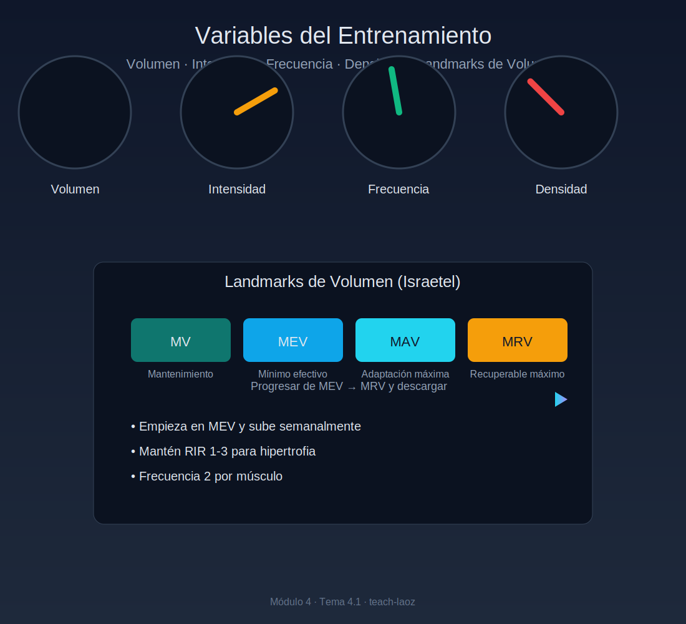

# Tema 4.1: Variables del Entrenamiento y los "Landmarks" de Volumen

## Introducción: El Ecualizador del Entrenador

No entrenas en el vacío. Cada vez que tocas una pesa, estás manipulando cuatro variables: Volumen, Intensidad, Frecuencia y Densidad.
El error del novato es querer subir todas a la vez.
El experto sabe que son vasos comunicantes. Si subes una, otra debe bajar.

## 1. Volumen: Los "Landmarks" de Mike Israetel

El volumen es la cantidad total de trabajo duro. Pero, ¿cuánto es "mucho" y cuánto es "poco"?
Usamos los **Landmarks de Volumen** para navegar:

1. **MV (Maintenance Volume)**: Lo mínimo para no perder músculo.
    * *Dosis*: Sorprendentemente baja. ~6 series semanales por músculo. Útil en épocas de estrés o exámenes.
2. **MEV (Minimum Effective Volume)**: Lo mínimo para empezar a crecer.
    * *Dosis*: ~10 series semanales. Si haces menos de esto, estás perdiendo el tiempo.
3. **MAV (Maximum Adaptive Volume)**: La zona donde ocurre el mejor crecimiento.
    * *Dosis*: Entre MEV y MRV (~12 a 20 series). **Tu objetivo es pasar la mayor parte del tiempo aquí.**
4. **MRV (Maximum Recoverable Volume)**: El techo de cristal. Si haces más que esto, no te recuperas. Retrocedes.
    * *Dosis*: ~20-25+ series (muy individual).

**La Estrategia**: Empieza el mesociclo en el MEV (pocas series) y ve subiendo semana a semana hasta acercarte al MRV. Luego, descarga.

## 2. Intensidad: Carácter del Esfuerzo

No confundir con "peso en la barra". Intensidad es **proximidad al fallo**.

* **Fallo (RIR 0)**: No puedes más. Muy efectivo, pero genera mucha fatiga.
* **RIR 1-3**: Lo ideal para hipertrofia. Estimulas todas las fibras sin quemar el Sistema Nervioso Central.
* **RIR > 4**: Basura ("Junk Volume"). A menos que seas un novato total o estés practicando técnica, esto no crea músculo.

## 3. Frecuencia: ¿Repartir o Concentrar?

La ciencia es clara: Para el culturista natural, **Frecuencia 2 es superior a Frecuencia 1**.

* ¿Por qué? Porque la síntesis proteica dura 48h. Si entrenas pecho el lunes, el jueves ya no crece más. Si esperas al lunes siguiente, has perdido 4 días de crecimiento potencial.
* **Recomendación**: Toca cada músculo 2 veces por semana (o cada 3-4 días).

## 4. Densidad: Trabajo por Tiempo

* **Definición**: Cuánto trabajo haces en una hora.
* **Densidad Alta**: Descansos cortos (30-60s), súper-series. (Mayor estrés metabólico, menor carga de peso).
* **Densidad Baja**: Descansos largos (3-5 min), series directas. (Mayor tensión mecánica, mayor carga).
* *Nota*: No busques densidad alta en ejercicios pesados (Sentadilla). Ahogarse no es entrenar.

## Resumen

Tu programa debe empezar cerca del MEV (fácil) e ir subiendo volumen hacia el MRV.
Mantén la Intensidad alta (RIR 2) siempre.
Entrena cada músculo 2 veces por semana.
Así se ve un programa científico.
