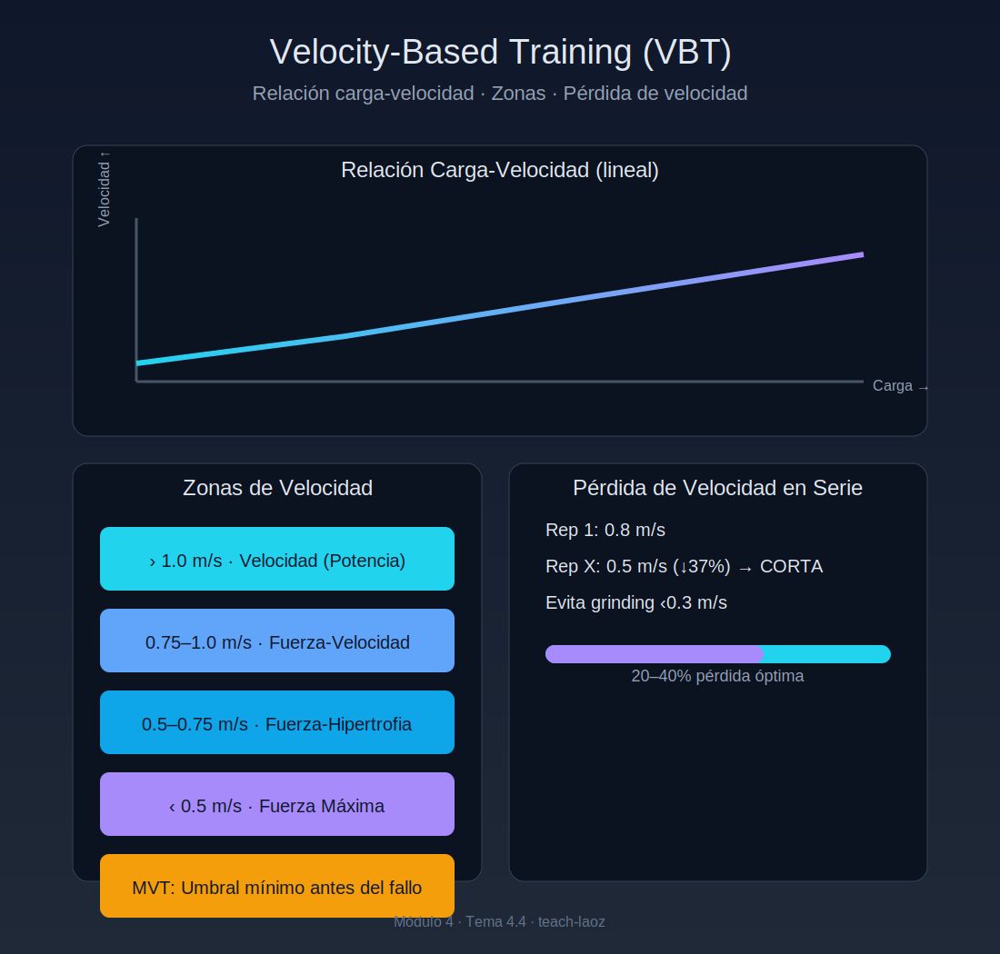

# Tema 4.4: Velocity Based Training (VBT) - La Velocidad no Miente

## Introducción: El Adiós al % de 1RM

Hoy te toca hacer sentadillas al 80% de tu 1RM.
Pero anoche dormiste mal y tu novia te dejó. Hoy tú "real" 100% es mucho más bajo que ayer. Si usas el peso calculado en Excel hace un mes, te aplastarás (o te lesionarás).
El **VBT** soluciona esto. Tu velocidad de levantamiento TE DICE cuál es tu fuerza real HOY.

## 1. La Relación Carga-Velocidad

Es una ley física universal: **A mayor peso, menor velocidad**.
Esta relación es tan perfecta y lineal (r=0.99) que si mides la velocidad de la primera repetición, puedes saber exactamente a qué % del 1RM equivale ese peso HOY.

## 2. Las Zonas de Velocidad (Speed Zones)

Si tienes un encoder (aparato que mide velocidad en m/s), estos son los números mágicos:

* **> 1.0 m/s (Velocidad Pura)**: Estás trabajando con cargas muy ligeras (<30%). Potencia balística. Salto vertical.
* **0.75 - 1.0 m/s (Fuerza-Velocidad)**: Potencia con carga moderada (Clean & Jerk, Dynamic Effort).
* **0.5 - 0.75 m/s (Fuerza-Hipertrofia)**: El punto dulce del culturismo. Cargas moderadas-altas.
* **< 0.5 m/s (Fuerza Máxima / Grinding)**: Zona de peligro y récords. Aquí se mueven los pesos máximos.
* **MVT (Minimum Velocity Threshold)**: Es la velocidad mínima a la que puedes mover una barra antes de fallar. Para Sentadilla es ~0.3 m/s. Para Banca ~0.15 m/s.

## 3. Autorregulación con VBT

Aquí está la magia práctica:

* Plan: "Haz Sentadillas con 100kg hasta que la velocidad baje de 0.5 m/s".
* *Día Bueno*: Haces 12 reps antes de bajar de 0.5 m/s. ¡Gran sesión!
* *Día Malo*: Haces 4 reps y ya vas lento (0.4 m/s). Paras.
* **Resultado**: El volumen se ajusta solo a tu fatiga diaria. Nunca te pasas, nunca te quedas corto.

## 4. Pérdida de Velocidad en la Serie (Velocity Loss)

¿Cuándo terminar una serie de hipertrofia?
La ciencia dice que el estrés metabólico óptimo ocurre cuando pierdes un **20-40%** de velocidad desde la primera repetición hasta la última.

* Rep 1: 0.8 m/s.
* Rep X: 0.5 m/s (Pérdida del 37%). -> **CORTA LA SERIE**.
* Seguir más allá ("Grinding" a 0.2 m/s) genera mucha fatiga y poco beneficio extra en atletas de rendimiento.

## Resumen

El VBT es el futuro. Convierte el "creo que fue duro" en "fue exactamente 0.35 m/s".
Si no tienes encoder, usa la percepción (RPE), que es el VBT de los pobres (y funciona muy bien).
