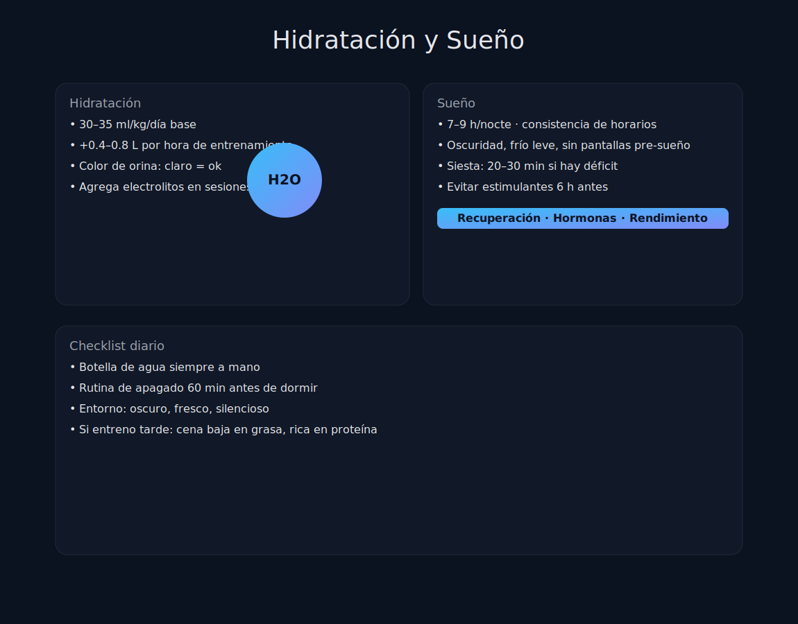

# Tema 5.3: Hidratación y Sueño (Los Cimientos Invisibles)

## Introducción: El Coche sin Aceite

Puedes tener el mejor motor (Entreno) y la mejor gasolina (Nutrición), pero si no tienes aceite (Agua) el motor gripará. Y si no lo llevas al taller por la noche (Sueño), se romperá.
Son aburridos, no se venden en botes bonitos, pero son el 90% de tu recuperación.

## 1. Hidratación: Más que Agua

* **El Mito**: "Bebe 2 litros al día".
* **La Realidad**: Depende de cuánto sudes. Un levantador pesado en verano puede perder 2-3 litros en una sesión.
* **Deshidratación = Pérdida de Fuerza**: Perder solo un 2% de tu peso en agua (ej. 1.6kg en alguien de 80kg) reduce tu fuerza un 10-20% y aumenta el RPE. Te sientes débil.

### Electrolitos (La Sal de la Vida)

El sudor no es agua destilada. Es salado.
Si solo bebes agua sola, diluyes tu sangre (hiponatremia) y el cuerpo la orina para recuperar el equilibrio. **No hidratas, solo lavas.**

* **Solución**: Añade una pizca de sal marina (Sodio) a tu botella intra-entreno. El sodio retiene el agua DENTRO del cuerpo.

## 2. Sueño: El Anabólico Natural

Mientras duermes, ocurren dos cosas mágicas:

1. **Hormona de Crecimiento (GH)**: Se libera en picos masivos durante el sueño profundo.
2. **Limpieza Neural**: El sistema glinfático limpia los desechos del cerebro.

### Privación de Sueño (Dormir < 6h)

* Aumenta el Cortisol (Catabólico).
* Reduce la sensibilidad a la insulina (engordas más fácil).
* Aumenta la Grelina (Hambre).
* **Rendimiento**: Dormir 5 horas equivale a ir al gimnasio "ligeramente borracho". Tu coordinación y fuerza bajan.

## 3. Protocolo de Higiene del Sueño

Si no puedes dormir 8 horas, asegúrate de que las que duermas sean de calidad.

1. **Oscuridad Total**: Usa antifaz o persianas blackout. La luz inhibe la melatonina.
2. **Frío**: La habitación debe estar fresca (18-20°C). El cuerpo necesita bajar su temperatura para entrar en sueño profundo.
3. **No Pantallas**: La luz azul del móvil le dice a tu cerebro "es de día". Usa filtros de luz roja o lee un libro de papel.
4. **No Cafeína**: (Ya lo vimos en 5.2).

## Resumen

Antes de comprar un suplemento de 50€:

1. ¿Estás meando claro (amarillo pálido)?
2. ¿Estás durmiendo 7-8 horas a oscuras?
Si la respuesta es no, empieza por ahí. Es gratis y funciona mejor.
