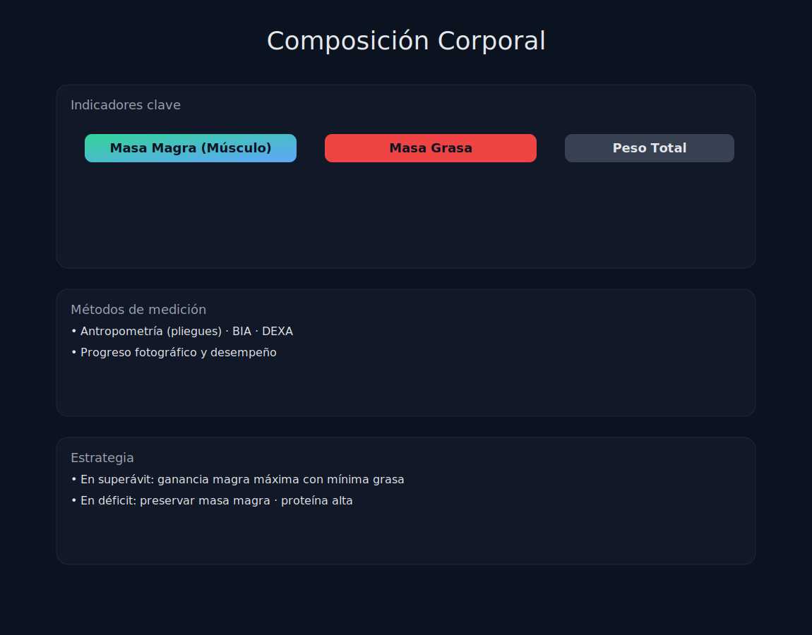

# Tema 5.6: Nutrición para Composición Corporal (Mini-Cuts y Reverse Dieting)

## Introducción: El Arte de Subir y Bajar

Comer siempre igual lleva a estancarse siempre igual.
El cuerpo se adapta (Homeostasis). Si comes poco mucho tiempo, tu metabolismo baja. Si comes mucho, te pones gordo.
La solución son las fases cortas y agresivas.

## 1. El Mini-Cut (Definición Relámpago)

Estás en fase de volumen. Llevas 4 meses ganando músculo, pero también has ganado grasa y te sientes pesado/hinchado.
No necesitas una definición de 3 meses. Necesitas un **Mini-Cut**.

* **Duración**: 2 a 6 semanas (máximo).
* **Déficit**: Agresivo (hasta -1000 kcal o 1% peso/semana).
* **Objetivo**:
    1. Limpiar el exceso de grasa rápido.
    2. Resensibilizar el cuerpo a la insulina y a la comida.
    3. Volver al volumen con el cuerpo "limpio" para crecer más eficientemente.
* **Ventaja**: Como es corto, no pierdes músculo.

## 2. Reverse Dieting (Dieta Inversa)

Acabas de terminar una definición larga (dieta estricta). Estás seco, pero pasas hambre y tu metabolismo está en el suelo.
Si vuelves a comer "normal" de golpe -> Efecto Rebote brutal (ganas toda la grasa en 2 semanas).

* **Estrategia**: Subir calorías muy poco a poco.
* **Protocolo**: Añadir +50/100 kcal (principalmente carbos) cada semana.
* **Objetivo**: Enseñar a tu metabolismo a acelerarse de nuevo sin acumular grasa. Llegar a tus calorías de mantenimiento comiendo mucho más que antes.

## 3. Diet Breaks (Descansos de Dieta)

Estás definiendo por 12 semanas. En la semana 6, te estancas y estás deprimido.

* **Acción**: Tómate 1 o 2 semanas a Mantenimiento (sube calorías, sube carbos).
* **Efecto**:
    1. Baja el Cortisol (retención de líquidos desaparece -> "Efecto Whoosh").
    2. Se recuperan las hormonas tiroideas (T3/T4).
    3. Psicológicamente te reinicias.
* Luego vuelves al déficit y la grasa vuelve a bajar.

## Resumen

* **Mini-Cut**: Cuando el volumen te pone gordo. (Corto y duro).
* **Reverse Diet**: Cuando sales de una definición. (Lento y seguro).
* **Diet Break**: Cuando la definición se atasca. (Pausa estratégica).
No seas un robot lineal. Ondula tu ingesta.
