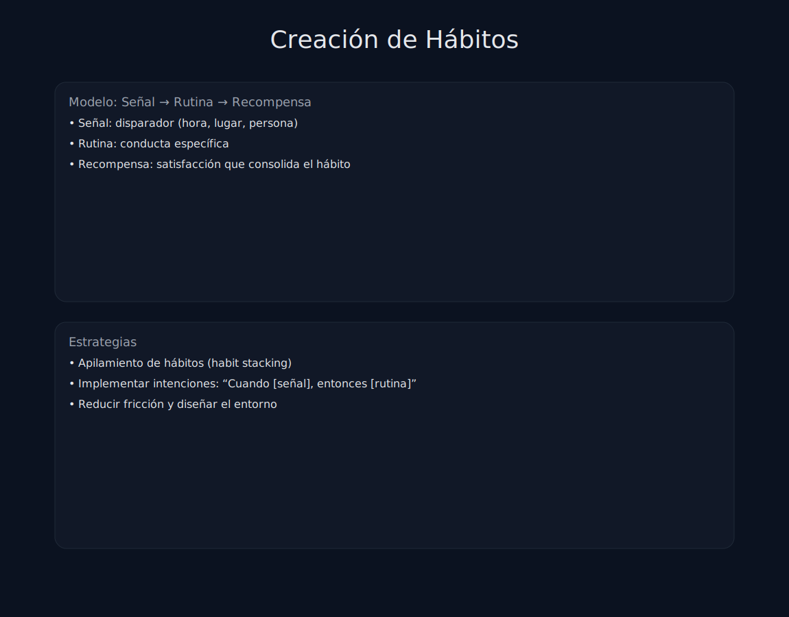

# Tema 6.3: Creación de Hábitos (La Ciencia de No Fallar)

## Introducción: La Motivación está Sobrecaracterizada

Depender de la motivación es como depender de que haga sol para ir a trabajar. Un día lloverá (tendrás un día horrible) y no irás.
Los profesionales no dependen de la motivación, dependen de los **XÁBITOS**.
Usaremos el marco de "Atomic Habits" (James Clear) aplicado al fitness.

## 1. El Bucle del Hábito

Todo hábito tiene 4 fases. Si hackeas estas fases, controlas tu conducta.

1. **Señal (Cue)**: Lo que dispara la acción. (Ej: Ver las zapatillas).
2. **Anhelo (Craving)**: El deseo de cambio. (Ej: Querer aliviar el estrés).
3. **Respuesta (Response)**: La acción en sí. (Ej: Entrenar).
4. **Recompensa (Reward)**: El beneficio. (Ej: Endorfinas, batido rico).

## 2. Las 4 Leyes del Cambio de Conducta

### Ley 1: Hazlo OBVIO (Señal)

* No escondas la bolsa del gym. Déjala en la puerta bloqueando el paso.
* **Intención de Implementación**: "Yo haré [CONDUCTA] a las [HORA] en [LUGAR]". Escríbelo. Aumenta el éxito un 300%.

### Ley 2: Hazlo ATRACTIVO (Anhelo)

* **Temptation Bundling (Empaquetar tentaciones)**: "Solo puedo escuchar mi podcast favorito de crímenes reales MIENTRAS estoy en la elíptica".
* Si quieres ver Netflix, hazlo estirando.

### Ley 3: Hazlo FÁCIL (Respuesta)

* **Regla de los 2 Minutos**: Los días que no quieras ir, di: "Solo iré, me pondré las zapatillas y haré una serie". Si quieres irte después, vete.
  * *Truco*: Una vez allí, casi nunca te vas. Lo difícil es empezar, no continuar.
* Reduce la fricción: Apúntate al gym que está de camino al trabajo, no al que es "mejor" pero está a 20 min en dirección contraria.

### Ley 4: Hazlo SATISFACTORIO (Recompensa)

* El cerebro prioriza el placer inmediato. El "cuerpo fitness" tarda meses (recompensa retardada).
* Necesitas recompensas inmediatas: Un batido que sepa delicioso, marcar una X roja en el calendario (rastreador visual), o poner 1€ en un bote para un viaje.

## 3. Identidad > Resultado

El cambio más profundo es de identidad.

* *Nivel 1 (Resultado)*: "Quiero perder 5kg".
* *Nivel 2 (Proceso)*: "Voy a ir al gym".
* *Nivel 3 (Identidad)*: **"Soy un atleta"**.
Un atleta no se pregunta "¿hoy entreno?". Un atleta entrena porque es lo que hacen los atletas.
Ayuda a tu cliente a cambiar su frase de "estoy intentando ir al gym" a "soy una persona activa".

## Resumen

No busques fuerza de voluntad hercúlea.
Diseña un entorno donde hacer lo correcto sea fácil y obvio, y hacer lo incorrecto sea difícil e invisible.
