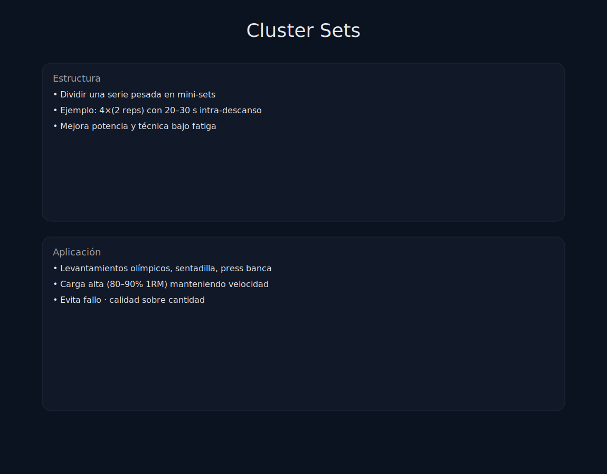

# Tema 7.2: Cluster Sets y Descansos Intra-Serie

## Introducción: La Calidad sobre la Cantidad

En una serie tradicional de 10 repeticiones (Straight Set), la repetición 1 es perfecta y rápida. La repetición 10 es lenta, fea y técnica basura.
¿Qué pasaría si pudieras hacer 10 repeticiones, pero que TODAS fueran igual de rápidas y técnicas que la primera?
Bienvenido al mundo de los **Cluster Sets**.

## 1. ¿Qué es un Cluster Set?

Es dividir una serie larga en varios bloques pequeños con micro-descansos entre ellos.

* **Tradicional (3x6)**: Haces 6 seguidas. Descansas 3 min.
* **Cluster (3 x 2+2+2)**: Haces 2 reps, descansas 15s (sueltas barra), haces 2 reps, descansas 15s, haces 2 reps. Descansas 3 min.
  * *Total*: Has hecho las mismas 6 repeticiones.

## 2. ¿Por qué funciona? (Fisiología)

Esos 15 segundos de aire permiten:

1. **Regenerar Fosfocreatina (PCr)**: Recuperas un poco de gasolina "Nitro".
2. **Limpiar Lactato**: El músculo respira.
3. **Mantener la Velocidad**: En la tradicional, la velocidad baja a 0.3 m/s al final. En el Cluster, mantienes 0.5 m/s en todas. Y recuerda: **Potencia = Fuerza x Velocidad**.

## 3. Tipos de Clusters

### A. Cluster de Potencia (Hipertrofia de Fibras II)

Para halterofilia o movimientos explosivos.

* *Esquema*: 5 series de (1 rep + 20s descanso + 1 rep + 20s descanso ... hasta 5 reps total).
* *Carga*: 85-90% 1RM.
* *Resultado*: Levantas un volumen total brutal con una calidad técnica perfecta.

### B. Cluster de Hipertrofia (Muscle Rounds)

Popularizado por Dr. Scott Stevenson (Fortitude Training) y Doggcrapp.

* *Esquema*: Eliges un peso para 10-12RM.
* Haces 4 repeticiones. (Descansa 10s).
* Haces 4 repeticiones. (Descansa 10s).
* Haces 4 repeticiones. (Descansa 10s).
* Haces 4 repeticiones.
* *Total*: 16 reps con un peso de 12RM.
* *Resultado*: Has superado tu límite natural de repeticiones gracias a las micro-pausas. Estrés mecánico extremo.

## 4. Myo-Reps (Rest-Pause Variante)

Inventado por Borge Fagerli.

1. **Serie de Activación**: Haz repeticiones hasta casi el fallo (ej. 15 reps).
2. **Micro-Series**: Descansa 3-5 respiraciones profundas. Haz 3-5 reps. Descansa. Haz 3-5 reps...
3. Repite hasta que no puedas sacar 3 reps.

* *Lógica*: Como ya estás fatigado de la serie inicial, CADA repetición de las micro-series recluta el 100% de fibras ("Effective Reps"). Eficiencia temporal máxima.

## Resumen

Los Clusters son la herramienta para:

1. Mantener la **Potencia** (Velocidad).
2. Mantener la **Técnica** (Seguridad).
3. Acumular más **Volumen** con el mismo peso (Hipertrofia).
Úsalos en ejercicios complejos (Sentadilla, Clean), no pierdas tiempo haciendo clusters de curl de bíceps.
