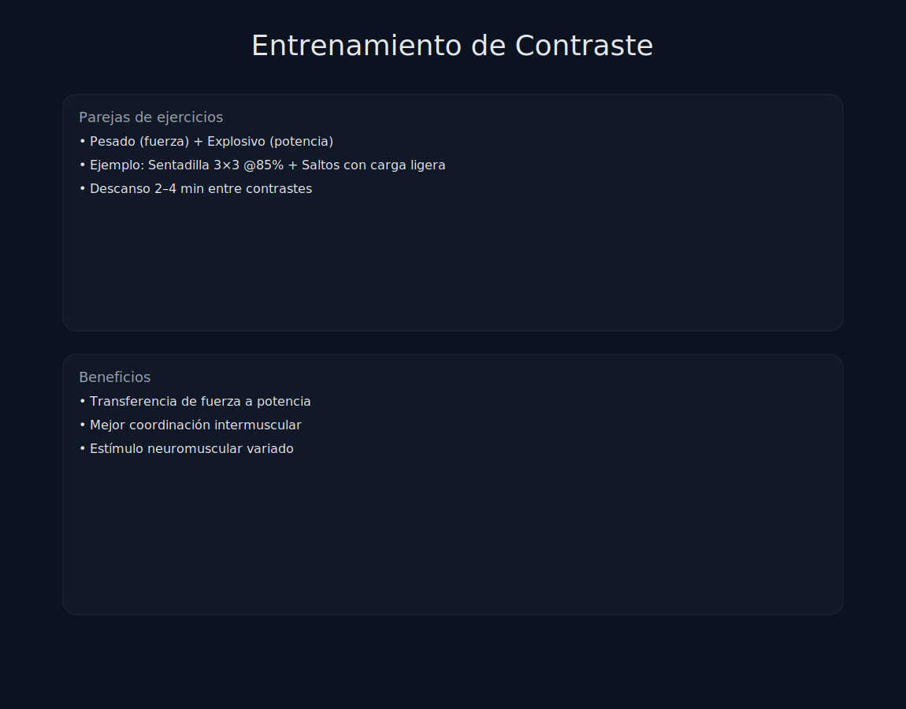

# Tema 7.4: Entrenamiento de Contraste (Complex Training)

## Introducción: La Pareja Perfecta

Ya vimos la teoría (PAP). Ahora veremos la práctica: **Complex Training**.
Se trata de combinar ejercicios de "Fuerza Lenta" con "Velocidad Rápida" en la misma sesión para mover la curva Fuerza-Velocidad completa.

## 1. La Curva Fuerza-Velocidad

Para ser un atleta completo (fútbol, rugby, MMA), no basta con ser fuerte (Powerlifter) ni rápido (Velocista). Necesitas ambas.

* El Complex Training ataca los dos extremos en la misma serie.

## 2. Tipos de Complejos

### A. Ascendente (Standard Complex)

* **Orden**: Pesado -> Ligero.
* **Objetivo**: Usar la PAP para mejorar la explosividad.
* **Ejemplo**:
    1. Sentadilla (3 reps @ 85%).
    2. Descanso 3 min.
    3. Salto al Cajón (5 reps).

### B. Descendente (Reverse Complex)

* **Orden**: Ligero (Explosivo) -> Pesado.
* **Objetivo**: Pre-activar el SNC con velocidad para levantar más peso (Potenciación Neural) O fatigar las fibras rápidas para reclutar más.
* **Ejemplo**:
    1. Saltos Verticales (5 reps).
    2. Descanso 2 min.
    3. Sentadilla (3 reps @ 85%).

### C. Contraste de Carga (Wave Loading)

Olvídate de explosivos. Alternas peso en la misma barra.

* Serie 1: 90kg x 3. (Pesado).
* Serie 2: 70kg x 6. (Ligero/Rápido).
* Serie 3: 92.5kg x 3. (Pesado).
* Serie 4: 72.5kg x 6. (Ligero/Rápido).
* *Efecto*: La serie pesada hace que la liviana se sienta como una pluma (velocidad aumenta). La serie liviana da un descanso neural relativo para volver a tirar pesado.

## 3. Programación

No puedes hacer esto siempre. Es muy demandante para el SNC.

* **Frecuencia**: 1 o 2 veces por semana máx.
* **Volumen**: Bajo (3-5 series por complejo).
* **Descanso**: Generoso (2-4 min entre ejercicios, 5 min entre series).
* **Cuándo**: En la fase de Potencia o Transmutación, antes de competir.

## 4. Errores Comunes

1. **Exceso de carga en el explosivo**: Si haces saltos con mancuernas de 20kg, ya no es "velocidad", es "fuerza". Pierdes el contraste. El explosivo debe ser <30% 1RM.
2. **Mala técnica**: Hacer un Power Clean fatigado después de una Sentadilla es peligroso si no tienes técnica perfecta. Usa ejercicios simples (Saltos, Lanzamientos).

## Resumen

El Contraste enseña a tu cerebro a cambiar de marcha: De "Tractor" (Fuerza bruta) a "Ferrari" (Velocidad pura) en segundos.
Es el secreto de los atletas elásticos y potentes.
