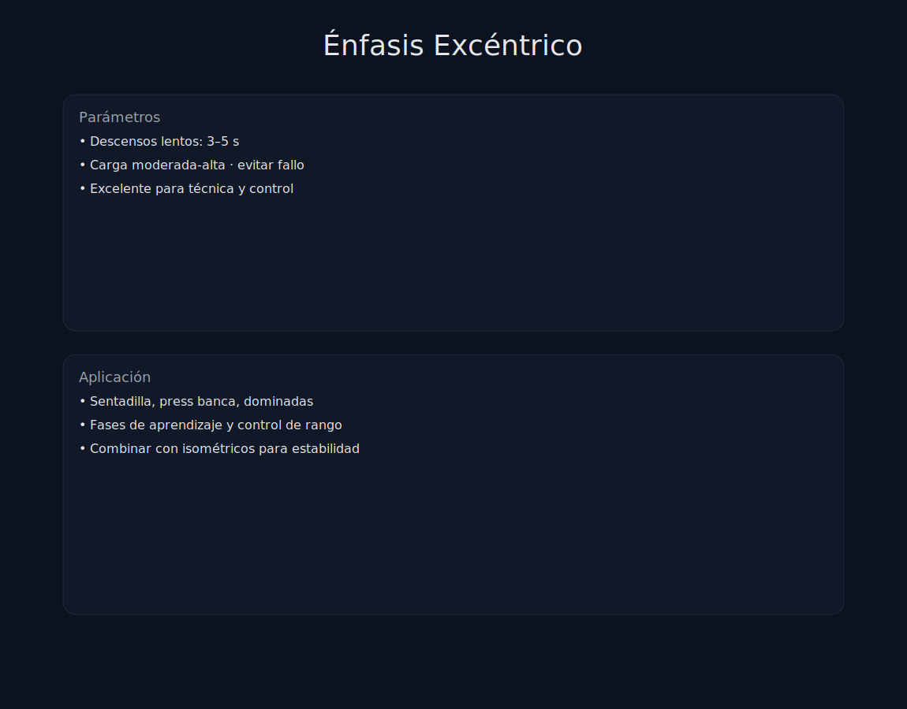

# Tema 7.5: Métodos Excéntricos (El Arte de Frenar)

## Introducción: Eres un 40% más fuerte bajando

Tu músculo tiene dos motores: Concéntrico (Subir) y Excéntrico (Bajar).
Lo curioso es que **eres un 20-50% más fuerte en la bajada**.
Si haces Press Banca con 100kg:

* Te cuesta la vida subirlo (estímulo 100% concéntrico).
* Pero bajarlo es "fácil" (estímulo 60% excéntrico). Desaprovechas fuerza.
Los métodos excéntricos avanzados buscan sobrecargar esa fase olvidada.

## 1. Beneficios Únicos de la Excéntrica

1. **Hipertrofia Longitudinal**: Añade sarcómeros en serie. El músculo se hace más largo y fuerte en estiramiento. (Clave para isquios).
2. **Tejido Conectivo**: Es lo único que fortalece tendones de verdad (rehabilitación tendinopatías).
3. **Coste Neural**: Daña mucho el músculo (agujetas), pero consume poca energía metabólica.

## 2. Métodos Avanzados

### A. Tempo Excéntrico (Lento)

El básico.

* *Protocolo*: Bajar en 4-6 segundos. Subir explosivo.
* *Uso*: Aprender técnica y aumentar tiempo bajo tensión.

### B. Método 2/1 (Dos arriba, uno abajo)

Ideal para máquinas.

* *Ejemplo*: Prensa de piernas.
  * Subes con las **DOS** piernas (Concéntrico fácil).
  * Quitas una pierna.
  * Bajas con **UNA** pierna (Excéntrico sobrecargado).
* *Ventaja*: Sobrecargas la bajada sin necesitar un compañero que te ayude a subir el peso.

### C. Ganchos Desprendibles (Weight Releasers)

El nivel Dios.

* Pones ganchos con peso extra en la barra.
* Bajas la Sentadilla con 120kg (100 barra + 20 ganchos). -> Sobrecarga excéntrica.
* Al tocar el suelo, los ganchos se sueltan.
* Subes solo con 100kg. -> Carga normal.
* *Resultado*: Estímulo máximo en ambas fases.

### D. Excéntricos Supra-Máximos

Peligroso. Solo expertos.

* Cargas el 110% de tu 1RM.
* Bajas la barra controlando (luchando por tu vida) 3-4 seg.
* Tus compañeros (spotters) suben la barra por ti. Tú no haces nada al subir.
* *Uso*: Romper mesetas de fuerza neural.

## 3. Riesgos: DOMS (Agujetas)

El daño muscular excéntrico es masivo.

* Si haces una sesión full excéntrica, no podrás caminar en 3 días.
* **Dosis**: Úsalo con cuentagotas. 1 ejercicio por sesión, 3-4 series. No te pases.

## Resumen

Si quieres tendones de acero y romper estancamientos, enfócate en la bajada.
Pero ten cuidado: es la herramienta que más agujetas genera del mundo.
