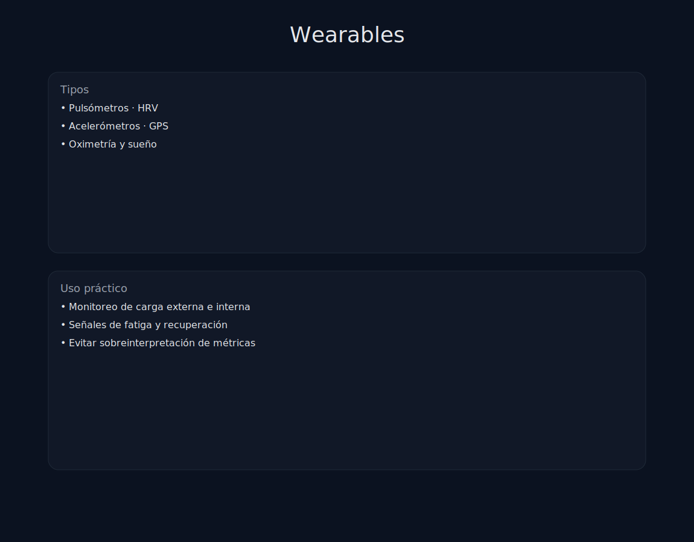

# Tema 8.2: Wearables y HRV (El Semáforo Interno)

## Introducción: Llevas un laboratorio en la muñeca

Hace 10 años, medir la variabilidad cardíaca requería un ECG de hospital.
Hoy, tu reloj (Apple Watch, Garmin, Whoop, Oura) lo hace mientras duermes.
El problema no es tener datos, es saber qué significan.

## 1. HRV (Variabilidad de la Frecuencia Cardíaca)

No confundir con Pulso (Latidos por minuto).

* **Qué es**: La variación de tiempo (milisegundos) entre latido y latido.
* **Contraintuitivo**:
  * Un corazón sano es **CAÓTICO** (HRV Alta). Se adapta instante a instante.
  * Un corazón estresado es **METRÓNOMO** (HRV Baja). Late rígido, modo supervivencia.
* **Lectura**:
  * **HRV Alta (Verde)**: Sistema Parasimpático dominante. Estás recuperado y listo para morir entrenando.
  * **HRV Baja (Rojo)**: Sistema Simpático dominante (Lucha/Huida). Estás fatigado, enfermo o estresado. Entrena suave.

## 2. RHR (Frecuencia Cardíaca en Reposo)

Tu pulso nada más despertar.

* Si tu pulso basal sube de golpe 5-10 latidos -> Algo pasa. (Infección incubándose, alcohol anoche, sobreentrenamiento).
* Junto con la HRV, es el mejor detector de "enfermedad inminente" antes de que tengas síntomas.

## 3. Sleep Tracking (Fases de Sueño)

No mires solo "horas totales". Mira la calidad.

* **Sueño Profundo (Deep)**: Recuperación física (Hormona crecimiento). Si es bajo, te sentirás roto físicamente.
* **Sueño REM**: Recuperación mental y aprendizaje motor. Si es bajo, estarás torpe y de mal humor.
* **Latencia**: ¿Cuánto tardas en dormirte?
  * < 5 min: Estás privado de sueño (agotado).
  * \> 30 min: Insomnio o estabas con el móvil.

## 4. Carga de Entrenamiento (Acute vs Chronic)

Los relojes calculan cuánto entrenas.

* **Ratio Agudo/Crónico (ACWR)**: Compara lo que has hecho esta semana (Fatiga) con lo que has hecho las últimas 4 semanas (Forma física).
* **Sweet Spot**: 0.8 - 1.3. (Progresión segura).
* **Danger Zone**: > 1.5. (Has subido la carga demasiado rápido -> Riesgo de lesión dispara).

## Resumen

Usa el reloj como un CONSULTOR, no como un JEFE.

* Si el reloj dice "Estás al 100%" pero tú te sientes fatal -> Escucha a tu cuerpo.
* Si el reloj dice "Estás fatal" y tú te sientes bien -> Ten precaución, quizás la bajada venga mañana.
La tendencia semanal importa más que el dato diario.
