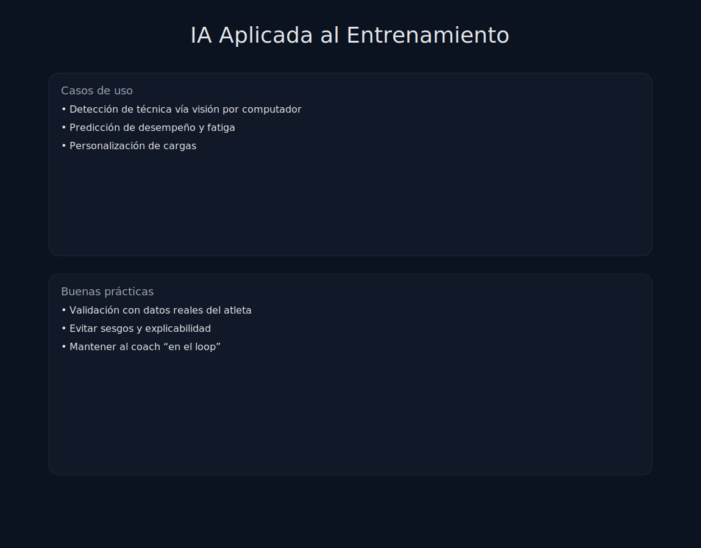

# Tema 8.4: Inteligencia Artificial en el Entrenamiento (Tu Copiloto)

## Introducción: ¿Me va a sustituir un robot?

No. La IA no tiene empatía, no puede corregir un matiz emocional en la cara de un cliente, y no puede dar un abrazo.
Pero la IA puede procesar 1 millón de datos en 1 segundo. Tú no.
La IA no te sustituye, te **aumenta**.

## 1. Predicción de Lesiones (Machine Learning)

El "Santo Grial".

* Si alimentas a una IA con datos de: Carga (ACWR), Sueño, Estrés y Movilidad.
* La IA detecta patrones invisibles: "Cuando el atleta duerme <6h y aumenta su carga un 20% en sentadilla, se rompe el isquio el 85% de las veces".
* **Alerta Temprana**: El sistema te avisa: "Riesgo de lesión Alto. Reduce carga hoy".

## 2. Programación Generativa

Apps como **JuggernautAI** o **Fitbod**.

* Tú dices: "Tengo 45 min, me duele la rodilla y solo tengo mancuernas".
* La IA genera INSTANTÁNEAMENTE la sesión óptima para esas restricciones, ajustando volumen e intensidad basado en tu histórico.
* *Ventaja*: Hiper-individualización a escala. Un humano tardaría 30 min en escribir eso. La IA tarda 0.1s.

## 3. Computer Vision (Análisis de Movimiento sin Sensores)

Apps como **Spleeft** o **Keiser**.

* Usan la cámara del móvil.
* La IA reconoce tus articulaciones (esqueleto digital) en el vídeo.
* Calcula la velocidad de la barra, el ángulo de la rodilla y la trayectoria.
* **Democratización**: Antes necesitabas un laboratorio de biomecánica de 100.000€. Ahora lo tienes en el bolsillo por 10€/mes.

## 4. ChatGPT para Entrenadores

No le pidas "dame una dieta". Úsalo como asistente administrativo.

* *Prompt*: "Tengo un cliente con condromalacia rotuliana. Dame 10 alternativas a la Sentadilla que no tengan impacto y enfaticen la cadera".
* *Resultado*: Te da ideas que quizás habías olvidado (Spanish Squat, Reverse Lunge).
* *Prompt*: "Resume este paper científico sobre hipoxia intermitente en 3 puntos clave para un entrenador".
* *Resultado*: Te ahorras 2 horas de lectura técnica.

## Resumen

La IA es una calculadora glorificada. Es inútil si no sabes qué calcular.
Si eres un mal entrenador, la IA te hará incompetentemente más rápido.
Si eres un buen entrenador, la IA te dará superpoderes de análisis.
