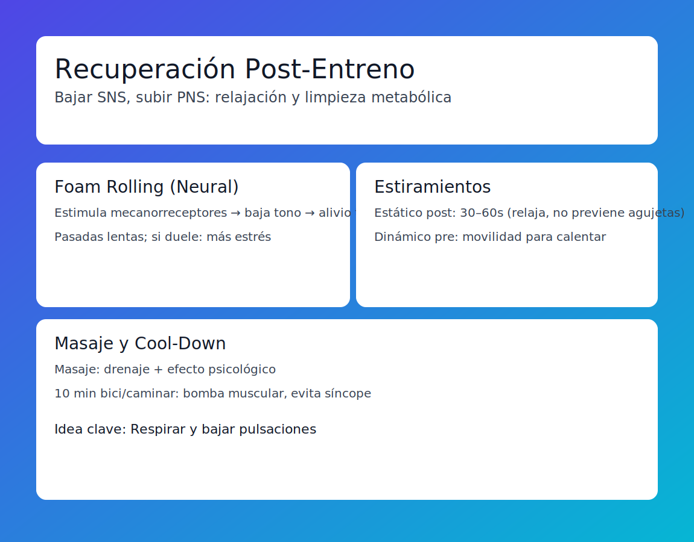

# Tema 9.1: Protocolos de Recuperación Post-Entreno (Mitos y Verdades)

## Introducción: No puedes acelerar la biología (pero puedes dejar de frenarla)

El cuerpo se cura a su ritmo. No existe una "píldora mágica" que repare un desgarro muscular en 1 hora.
Sin embargo, podemos facilitar el entorno para que el cuerpo haga su trabajo.
El objetivo de la recuperación post-entreno NO es "eliminar el ácido láctico" (eso se va solo en 30 min), es **apagar el Sistema Nervioso Simpático** (Estrés) y encender el Parasimpático (Relax).

## 1. Foam Rolling (Liberación Miofascial)

* **¿Rompe adherencias?**: No. La fascia es más dura que el acero. Un rodillo de espuma no la deforma físicamente.
* **¿Entonces qué hace?**: Es un input **NEURAL**. Estimula los mecanorreceptores de la piel -> El cerebro recibe la señal "baja el tono" -> El músculo se relaja momentáneamente.
* **Protocolo**: Pasadas lentas y suaves. Si duele tanto que aguantas la respiración, estás aumentando el estrés (cortisol), no bajándolo.

## 2. Estiramientos (Stretching)

* **Estático (Post-Entreno)**: Mantener 30-60s.
  * *Beneficio*: Relajación mental y ligera reducción de la rigidez muscular (stiffness) temporal.
  * *Mito*: "Estirar previene agujetas". FALSO. Cientos de estudios lo demuestran. Las agujetas son micro-roturas; estirar una tela rota no la arregla.
* **Dinámico (Pre-Entreno)**: Movilidad. Ese es para calentar.

## 3. Masaje Deportivo

* **Efecto Mecánico**: Drenaje linfático y retorno venoso (ayuda a mover fluidos estancados).
* **Efecto Psicológico**: El contacto humano terapéutico reduce la ansiedad y el cortisol drásticamente.
* *Nota*: Un masaje "destructor" (muy profundo) post-competición puede ser contraproducente porque añade más daño muscular al daño del partido.

## 4. Cool-Down (Vuelta a la Calma) Activa

10 minutos de bici suave o caminar al terminar la sesión.

* **La Bomba Muscular**: Las contracciones suaves ayudan al corazón a "limpiar" los metabolitos residuales.
* Evita el "Sincope Post-Esfuerzo": Si paras de golpe tras un sprint, la sangre se queda en las piernas y te mareas.

## Resumen

La mejor herramienta de recuperación post-entreno es **RESPIRAR** y bajar las pulsaciones.
El Foam Roller y los estiramientos son buenos si te RELAJAN. Si te duelen, son contraproducentes.
No confundas "sensación de alivio" con "reparación de tejidos".
