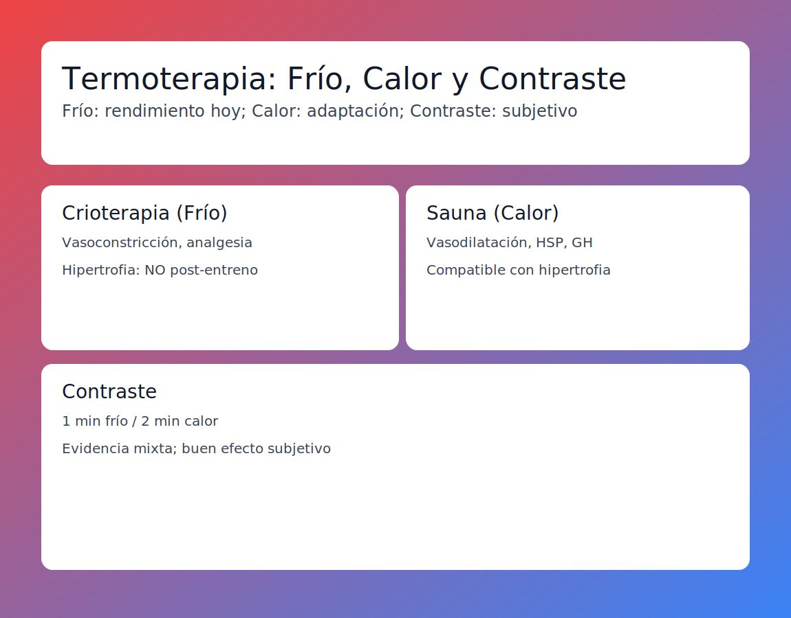

# Tema 9.2: Termoterapia (Frío, Calor y Contraste)

## Introducción: Fuego y Hielo

¿Hielo para bajar la inflamación o calor para relajar?
La respuesta incorrecta puede frenar tus ganancias musculares.
Vamos a ver cómo la temperatura afecta a la fisiología.

## 1. Crioterapia (Frío / Inmersión en Agua Helada)

Meterse en una bañera con hielos (10-15ºC) durante 10-15 min.

* **Efecto**: Vasoconstricción brutal. Reduce el flujo sanguíneo, la inflamación y el dolor (analgesia).
* **¿Bueno o Malo?**:
  * **PARA HIPERTROFIA**: **MALO**. La inflamación aguda post-entreno es la SEÑAL que activa el crecimiento satelital. Si la cortas con hielo, **frenas el crecimiento muscular**. (Evidencia clara: menos músculo a largo plazo).
  * **PARA RENDIMIENTO**: **BUENO**. Si tienes un torneo con 2 partidos el mismo día, el hielo te quita el dolor y te permite correr en el segundo partido. Recuperación exprés a costa de adaptación a largo plazo.

## 2. Sauna (Calor)

Calor seco (80-100ºC) o húmedo.

* **Efecto**: Vasodilatación, aumento de Hormona de Crecimiento (GH) y "Proteínas de Choque Térmico" (Heat Shock Proteins).
* **Uso**: Aumenta el volumen plasmático (sangre) y mejora la resistencia cardiovascular.
* **Recuperación**: El calor relaja el tono muscular y mejora el riego sanguíneo (llevando nutrientes). Es compatible con la hipertrofia.

## 3. Terapia de Contraste

Alternar Frío (1 min) y Calor (2 min).

* **Teoría**: Crea un efecto de "bombeo" (vasoconstricción -> vasodilatación) que ayuda a limpiar desechos.
* **Realidad**: La evidencia es mixta. Funciona bien subjetivamente (te sientes "nuevo"), pero no hace milagros fisiológicos.

## Cuadro de Decisión: ¿Qué uso?

| Objetivo Cliente | Herramienta | Por qué |
| :--- | :--- | :--- |
| **Culturista (Off-Season)** | **NADA** o Calor Suave | Queremos inflamación y adaptación. El frío está prohibido post-entreno. |
| **Futbolista (Torneo, juega mañana)** | **HIELO (Inmersión)** | Necesitamos bajar dolor e inflamación YA para que pueda correr mañana. La hipertrofia da igual hoy. |
| **Powerlifter (Lesión crónica)** | **CALOR (Pre-entreno)** | Calentar la articulación antes de tirar pesado mejora la viscosidad. |

## Resumen

El hielo es un "botón de pausa" para la adaptación. Úsalo cuando necesites rendir HOY y te de igual mejorar MAÑANA.
El calor es un "amigo" de la adaptación.
