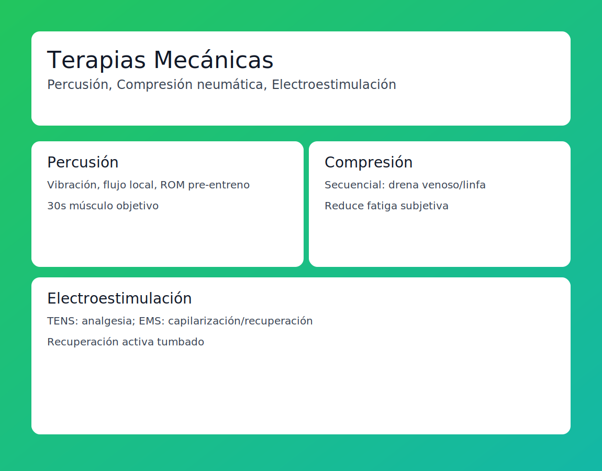

# Tema 9.3: Terapias Mecánicas (Pistolas y Botas)

## Introducción: La Tecnología del Masaje

¿Pagar 300€ por una pistola de masaje o unas botas de aire vale la pena?
Vivimos el boom de la "Percussive Therapy". Separemos el marketing de la fisiología.

## 1. Terapia de Percusión (Theragun, Hypervolt)

Una pistola que golpea el músculo a 2400 RPM.

* **Mecanismo**: Igual que el Foam Roller, pero más rápido y localizado.
    1. **Vibración**: Satura los receptores de dolor (Teoría de la Compuerta). El cerebro deja de sentir "dolor" y siente "vibración".
    2. **Riego Sanguíneo**: Aumenta el flujo local por fricción.
    3. **Rango de Movimiento (ROM)**: Usada PRE-entreno, mejora la movilidad temporalmente sin perder fuerza (diferencia clave con estiramiento estático).
* **Uso Ideal**:
  * **Pre-Entreno**: 30s en el músculo objetivo para "despertarlo".
  * **Intra-Serie**: 10s si sientes mucha tensión.
  * **Post-Entreno**: Para relajar (no repara, relaja).

## 2. Compresión Neumática (Normatec / Botas)

Unas botas gigantes que se inflan secuencialmente desde el pie hacia el muslo.

* **Mecanismo**: "Ordeña" las piernas. Imita la bomba muscular empujando la sangre venosa y la linfa hacia el corazón.
* **Eficacia**: La ciencia dice que **FUNCIONA** para reducir la sensación subjetiva de fatiga y aclarar lactato más rápido que el reposo pasivo. (Equivale a un masaje de drenaje linfático).
* **Cuándo**:
  * Después de tiradas largas (Running/Ciclismo) o días de pierna brutales.
  * Sentado en el sofá viendo Netflix. (Recuperación pasiva-asistida).

## 3. Electroestimulación (Compex / TENS / EMS)

* **TENS (Analgesia)**: Corriente que "hormiguea". Bloquea la señal de dolor. Útil para lesiones agudas, pero no cura.
* **EMS (Recuperación)**: Programa "Capilarización" o "Recuperación Activa". Produce sacudidas musculares suaves que bombean sangre sin fatiga central.
  * *Ventaja*: Puedes hacer recuperación activa estando tumbado.

## Resumen

Estas herramientas son "lujos útiles".
No son necesarias (caminar y dormir es gratis y hace el 90%), pero si tienes el presupuesto, añaden un 5-10% extra de confort y velocidad de recuperación, especialmente en atletas de alto volumen.

* **Pistola**: Para antes de entrenar (Movilidad).
* **Botas**: Para después de entrenar (Drenaje).
