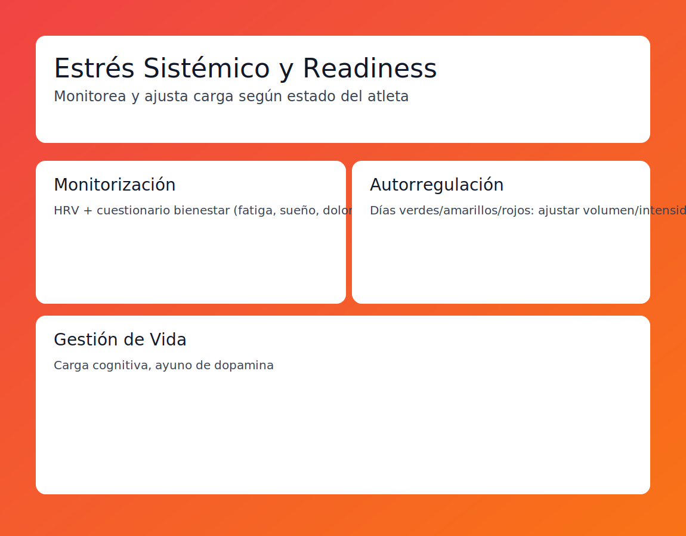

# Tema 9.6: Gestión del Estrés Sistémico (Readiness)

## Introducción: No eres una máquina, eres un ecosistema

El error clásico del entrenador es ver al atleta como un par de piernas que corren.
El atleta es un sistema complejo donde interactúan: Entreno + Nutrición + Psicología + Inmunología.
El **Estrés Sistémico** es la suma de TODO.

## 1. El Concepto de "Readiness" (Disponibilidad)

Es la respuesta a la pregunta: **"¿Cuánta gasolina tienes hoy en el tanque para gastar en el gym?"**.

* Si tu Readiness es 100%: Puedes hacer un entreno brutal y recuperarte.
* Si tu Readiness es 20%: Si haces un entreno brutal, cavas un hoyo del que tardarás 3 semanas en salir.

## 2. Monitorización del Readiness

No necesitas tecnología de la NASA.

1. **HRV (Objetivo)**: Visto en el tema 8.2. El "Check Engine" del cuerpo.
2. **Cuestionario de Bienestar (Subjetivo)**:
    * Pregunta a tu atleta cada mañana (Escala 1-5):
        * Fatiga (1=Muerto, 5=Fresco).
        * Calidad de Sueño.
        * Dolor Muscular.
        * Estrés (Vida/Trabajo).
        * Estado de Ánimo.
    * **Suma Total**: Si baja más de un 20% respecto a su media -> **Bandera Roja**.

## 3. Autorregulación del Entreno (Cybernetic Periodization)

El plan escrito en papel es solo una hipótesis. La realidad manda.

* **Escenario A (Días Verdes)**: Readiness Alto.
  * *Acción*: "Hoy vamos a por Récord Personal. Añade 5kg a la barra".
* **Escenario B (Días Amarillos)**: Readiness Medio.
  * *Acción*: "Sigue el plan tal cual".
* **Escenario C (Días Rojos)**: Readiness Bajo (Divorcio, gripe, insomnio).
  * *Acción*: "Corta el volumen a la mitad. Haz técnica suave. Vete a casa pronto".

## 4. Estrategias de Gestión de Vida

A veces el problema no es el gimnasio, es el estilo de vida.

* **Carga Cognitiva**: Un trabajo de oficina de 10 horas agota la glucosa cerebral igual que entrenar. El atleta llega "mentalmente vacío".
* **Ayuno de Dopamina**: Reducir redes sociales y estímulos constantes ayuda a bajar el "ruido de fondo" del sistema nervioso.

## Resumen

El mejor entrenador no es el que tiene la mejor hoja de Excel.
Es el que sabe decir "Hoy NO entrenamos duro" cuando el sistema del atleta está en alerta roja.
Protege al atleta de sí mismo.
